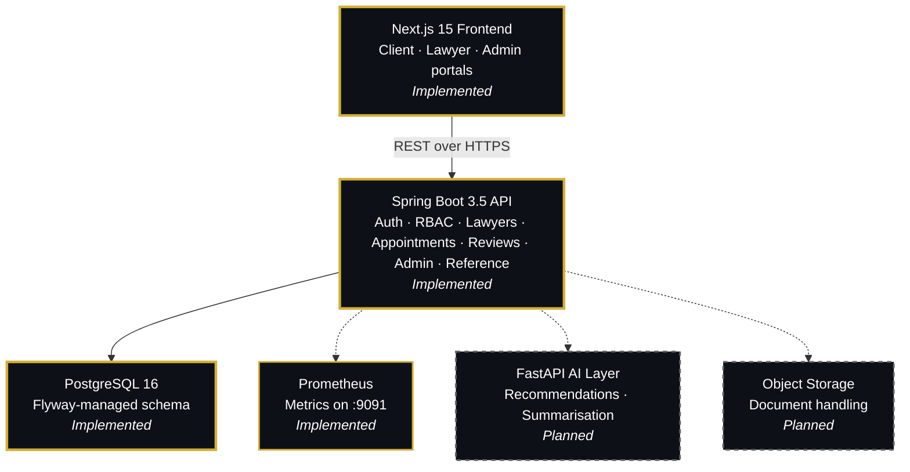
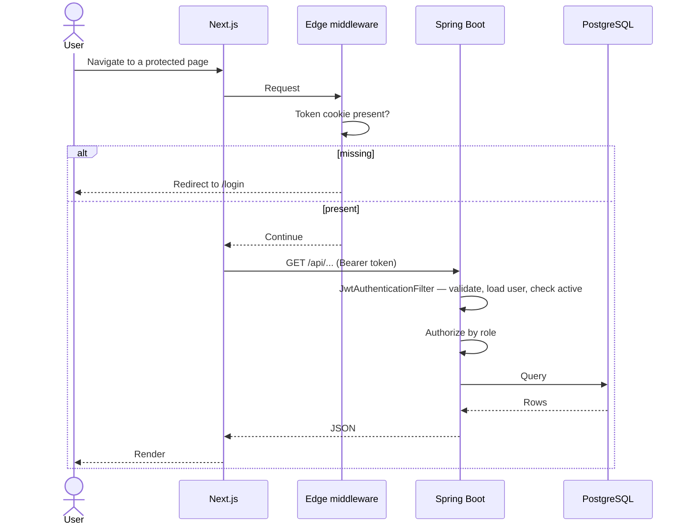

<div align="center">

<!-- Animated Typing Header -->
<a href="#">
</a>

<h3>Legal Consultation & Lawyer Discovery Platform</h3>

<p>A full-stack platform connecting clients with verified lawyers — search, compare, and book consultations without a single phone call.</p>

<p>


</p>

<p>


</p>

</div>

---

## Contents

- [Overview](#overview)
- [What works today](#what-works-today)
- [Architecture](#architecture)
- [Tech stack](#tech-stack)
- [Quick start](#quick-start)
- [Testing](#testing)
- [API](#api)
- [Project structure](#project-structure)
- [Documentation](#documentation)
- [Known limitations](#known-limitations)
- [Roadmap](#roadmap)

---

## Overview

Finding a lawyer in India usually means asking around and hoping the
recommendation is sound. VakilConnect replaces that with something checkable:
verified bar council credentials, published consultation fees, real
availability, and ratings that can only come from consultations that actually
happened.

**Three roles, one platform.** Clients search and book. Lawyers publish their
practice and manage requests. Administrators verify credentials and moderate.

> **Status.** Backend and frontend are both feature-complete for v1.0 and under
> release-candidate review. This is a private personal project — not intended
> for public use, deployment or distribution.

---

## What works today

Every item below is implemented and covered by tests.

**Authentication & authorization**
- Atomic single-step registration for clients and lawyers
- Stateless JWT with BCrypt password hashing
- Role-based access enforced server-side — deactivated and deleted users are
  rejected with 401, not 500
- Route protection layered across edge middleware, client guards and the API

**Lawyer discovery**
- Public search filtered by practice area, city, experience, fee and rating
- Only admin-verified lawyers appear in results
- Profile pages with credentials, availability and reviews

**Booking**
- Weekly availability published by each lawyer
- Appointments validated against those hours
- Double-booking prevented by a **partial unique index**, not application logic
  that could be raced
- Full lifecycle: pending → accepted / rejected → completed / cancelled

**Reviews**
- Only a client whose appointment was completed may review, once per lawyer
- Ratings aggregate automatically onto the public profile

**Administration**
- Bar council verification queue
- User activation and deactivation
- Review moderation with automatic rating recalculation
- Platform analytics

**Reference data**
- Normalised countries, states, cities and languages with historical aliases —
  "Bombay" resolves to Mumbai
- Curated specialization vocabulary, server-owned and enforced
- Typeahead city search backed by trigram indexes

**Operations**
- Flyway-managed schema with `ddl-auto: validate`
- Prometheus metrics on a dedicated management port
- Security headers on every frontend response

---

## Architecture



<div align="center">

**Gold, solid** = implemented &nbsp;&nbsp;|&nbsp;&nbsp; **Grey, dashed** = planned

</div>

### Request flow



The middleware checks only whether a token is *present* — the JWT carries no
role claim, so role enforcement happens where it is authoritative: on the
server.

### Layering

```text
Controller  →  Service  →  Repository  →  Entity
    ↓             ↓
   DTO       Business rules,
             @Transactional boundaries
```

Entities never leave the service layer; controllers speak only in DTOs. A
`GlobalExceptionHandler` maps typed exceptions onto status codes
(400 / 401 / 403 / 404 / 409) so no stack trace ever reaches a client.

---

## Tech stack

| Layer | Choices |
|:---|:---|
| **Backend** | Java 21, Spring Boot 3.5, Spring Security, Spring Data JPA, Hibernate 6 |
| **Database** | PostgreSQL 16, Flyway migrations, `pg_trgm` for search |
| **Caching** | Caffeine, for reference vocabularies |
| **Frontend** | Next.js 15 (App Router), React 19, TypeScript 5.7 |
| **UI** | Tailwind CSS, shadcn/ui, Radix primitives, lucide-react |
| **State** | TanStack Query (server state), Zustand (session and UI only) |
| **Forms** | React Hook Form + Zod, shared schemas |
| **Testing** | Testcontainers + JUnit 5 (backend), Vitest + Testing Library (frontend) |
| **Observability** | Micrometer, Prometheus, Spring Boot Actuator |

---

## Quick start

Full instructions, configuration reference and troubleshooting:
**[DEPLOYMENT.md](DEPLOYMENT.md)**

**Prerequisites:** JDK 21+, PostgreSQL 16, Node 20+, and Docker (for the backend
tests only).

```bash
# 1. Database — Flyway builds the schema on first start
createdb vakilconnect

# 2. Backend
cd backend
cp .env.example .env
#    Set JWT_SECRET. The app will not start without it, by design:
#      openssl rand -base64 32
set -a && source .env && set +a
./mvnw spring-boot:run                 # → http://localhost:8080

# 3. Frontend
cd ../frontend
cp .env.example .env.local
npm install && npm run dev             # → http://localhost:3000
```

Swagger UI: `http://localhost:8080/swagger-ui.html`

> **Do not run `database/schema.sql`.** It is a historical design artefact that
> no longer matches the migrations. Flyway owns the schema and Hibernate runs
> with `ddl-auto: validate`, so a hand-built schema fails startup.

All configuration is environment-driven and documented in
[`backend/.env.example`](backend/.env.example). `JWT_SECRET` deliberately has no
default, so a committed fallback secret can never reach production.

---

## Testing

```bash
cd backend  && ./mvnw clean test   # 224 tests — requires Docker
cd frontend && npm test            # 62 tests
```

### Backend — 224 integration tests across 16 files

They run against a **real PostgreSQL 16** in Docker via Testcontainers, not an
in-memory substitute. Every run applies the actual Flyway migrations with
Hibernate in `ddl-auto: validate`, so the tests exercise the production schema
exactly as deployed.

| Suite | Focus |
|:---|:---|
| `AuthControllerIT` | Registration, login, atomic lawyer signup, validation |
| `SecurityAuthorizationIT` | Anonymous / CLIENT / LAWYER / ADMIN matrix, token revocation |
| `AppointmentLifecycleIT` | Booking rules, availability boundaries, state machine, ownership |
| `AppointmentRepositoryIT` | Scoped queries, dashboard counts, partial unique index |
| `AdminLawyerVerificationIT` | Verification queue and idempotency |
| `ReferenceDataIT` · `ReferenceApiIT` · `ReferenceLinkageIT` | Seed integrity, public endpoints, entity mappings |
| `ReferenceDualWriteIT` · `ReferenceBackfillIT` · `ReferenceReadCutoverIT` | The reference-data migration, phase by phase |
| `ReferenceMigrationMetricsIT` · `ReferenceMigrationFreshnessTest` | Migration observability and cache staleness |

Deterministic by construction: no sleeps, no randomness, no fixed dates, unique
identifiers per test, and no assertion depends on an absolute row count —
test classes share one database.

**Defects these tests caught before any user did:** a PostgreSQL
`lower(bytea)` failure from untyped null parameters; a
`LazyInitializationException` returning 500 for every non-empty search; a
verified-but-500 admin action caused by a missing `@Transactional`; a
`min(uuid)` aggregate that does not exist in PostgreSQL; and an open redirect
in the login flow.

### Frontend — 62 unit tests

Pure logic, deliberately: routing and redirect safety, token storage, shared
validation, display formatting. `safeRedirect` gets the most attention because
it shipped an open redirect once already.

No component or snapshot tests yet — see [Roadmap](#roadmap).

---

## API

Base URL `http://localhost:8080`. Interactive documentation at
`/swagger-ui.html`.

<details>
<summary><b>Public</b></summary>

| Method | Endpoint |
|:---|:---|
| `POST` | `/api/auth/register` |
| `POST` | `/api/auth/login` |
| `GET` | `/api/lawyers` — search & filter |
| `GET` | `/api/lawyers/{id}` |
| `GET` | `/api/lawyers/{id}/reviews` |
| `GET` | `/api/lawyers/{id}/availability` |
| `GET` | `/api/reference/countries` · `/states` · `/cities` · `/cities/search` · `/languages` · `/specializations` |

</details>

<details>
<summary><b>Client</b></summary>

| Method | Endpoint |
|:---|:---|
| `GET` | `/api/users/me` |
| `GET` `PUT` | `/api/client/profile` |
| `GET` | `/api/client/dashboard` |
| `POST` `GET` | `/api/client/appointments` |
| `PUT` | `/api/client/appointments/{id}/cancel` |
| `POST` | `/api/client/appointments/{id}/review` |

</details>

<details>
<summary><b>Lawyer</b></summary>

| Method | Endpoint |
|:---|:---|
| `GET` | `/api/lawyer/dashboard` |
| `GET` `POST` `PUT` | `/api/lawyer/profile` |
| `POST` `GET` | `/api/lawyer/availability` |
| `DELETE` | `/api/lawyer/availability/{id}` |
| `GET` | `/api/lawyer/appointments` |
| `PUT` | `/api/lawyer/appointments/{id}/accept` · `/reject` · `/complete` |

</details>

<details>
<summary><b>Admin</b></summary>

| Method | Endpoint |
|:---|:---|
| `GET` | `/api/admin/dashboard` · `/analytics` |
| `GET` | `/api/admin/lawyers/pending` |
| `PUT` | `/api/admin/lawyers/{id}/verify` |
| `GET` | `/api/admin/users` |
| `PUT` | `/api/admin/users/{id}/activate` · `/deactivate` |
| `GET` | `/api/admin/reviews` |
| `DELETE` | `/api/admin/reviews/{id}` |

</details>

Errors share one envelope — `timestamp`, `status`, `error`, `message`, `path`,
`fieldErrors` — so clients parse failures the same way everywhere.

---

## Project structure

```text
├── backend/                             Spring Boot API
│  ├── src/main/java/com/arshraj/vakilconnect/
│  │  ├── auth/  user/  lawyer/          Registration, accounts, profiles & search
│  │  ├── appointment/  review/          Booking lifecycle, ratings
│  │  ├── admin/                         Verification, moderation, analytics
│  │  ├── reference/                     Countries, states, cities, languages
│  │  └── security/  common/  config/    JWT filter, exceptions, wiring
│  ├── src/main/resources/db/migration/  Flyway V1–V6
│  ├── src/test/java/                    224 integration tests
│  ├── docs/                             Migration observability & operations
│  └── .env.example
│
├── frontend/                            Next.js application
│  └── src/
│     ├── app/                           App Router — (public) and (protected)
│     ├── features/                      Feature modules, not component types
│     ├── components/                    ui/ (shadcn) · common/ · forms/ · layout/
│     ├── services/  types/              API clients and shared contracts
│     ├── lib/  hooks/  providers/       Axios, routes, query client, stores
│     └── test/                          Vitest setup
│
├── docs/                                Requirements & design specifications
├── database/                            Historical design artefacts — see note above
├── DEPLOYMENT.md                        Local development & production guide
└── README.md
```

---

## Documentation

| Document | Covers |
|:---|:---|
| **[DEPLOYMENT.md](DEPLOYMENT.md)** | Local setup, configuration, production, troubleshooting |
| [`backend/.env.example`](backend/.env.example) | Every backend variable, annotated |
| [`backend/docs/MIGRATION-OBSERVABILITY.md`](backend/docs/MIGRATION-OBSERVABILITY.md) | Metrics, meanings, cleanup gate |
| [`backend/docs/MIGRATION-OPERATIONS.md`](backend/docs/MIGRATION-OPERATIONS.md) | Deployment checklist, runbook, go/no-go |
| [`frontend/DESIGN-SYSTEM.md`](frontend/DESIGN-SYSTEM.md) | Tokens, typography, component conventions |
| [`frontend/SECURITY-NOTES.md`](frontend/SECURITY-NOTES.md) | Advisories and authorization invariants |
| [`docs/`](docs/) | Problem statement, scope, requirements, database design |

---

## Known limitations

Deliberate, and stated rather than left to be discovered:

| Limitation | Detail |
|:---|:---|
| **No payment processing** | Lawyers set their own fee; payment is arranged directly with them. No gateway, no commission |
| **No password reset** | No backend endpoint, token store or mail transport |
| **No email verification** | `is_email_verified` exists but nothing reads it — Spring's `enabled` maps to `active` instead |
| **No token refresh** | A single 24-hour JWT; expiry surfaces as a redirect to login |
| **Token readable by JavaScript** | `js-cookie` cannot set `httpOnly`; moving to it needs a proxy route |
| **CSP is Report-Only** | Reports violations without enforcing them; `X-Frame-Options` is the active clickjacking defence |
| **Manual verification** | An administrator checks each bar council number by hand |
| **No Docker or CI** | Every check to date has been run locally |

The legacy `lawyers.city` column, its dual-write and its fallback read path all
remain in place by design. Removing them is gated on production evidence that
the fallback is unused — see
[`MIGRATION-OPERATIONS.md`](backend/docs/MIGRATION-OPERATIONS.md).

---

## Roadmap

**Before 1.0** — Dockerfile and compose, CI running both suites on every push,
remove the stale `database/schema.sql`, disable Spring Security `DEBUG` logging
by default.

**Shortly after** — complete the reference-migration cleanup once the
observation window passes, enforce CSP, password reset, decide email
verification, enforce admin invariants server-side, frontend component tests.

**Later** — payments, `httpOnly` cookies via a proxy route, mobile navigation,
document storage, the FastAPI AI layer, courts reference data.

---

<div align="center">

**VakilConnect** — a private personal project.
Not intended for public use, deployment or distribution.

</div>
