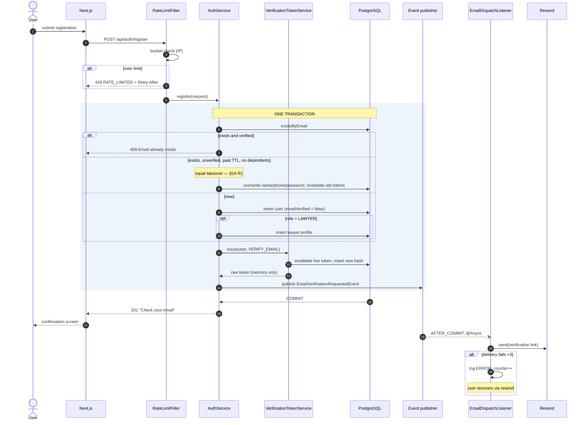
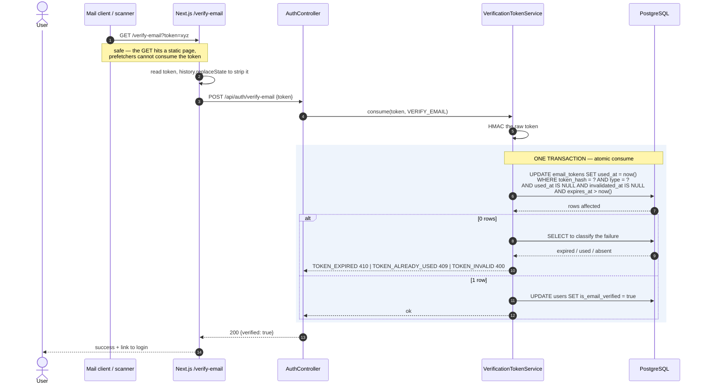
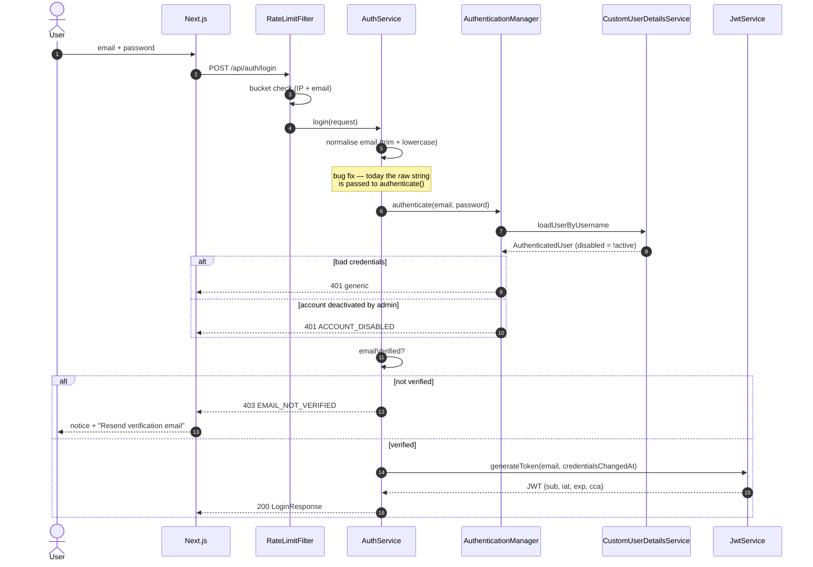
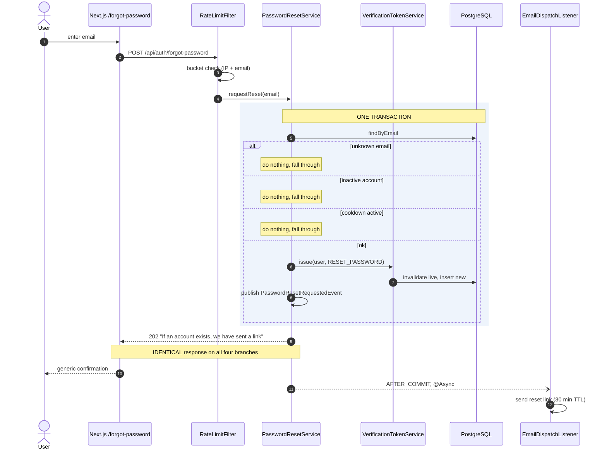
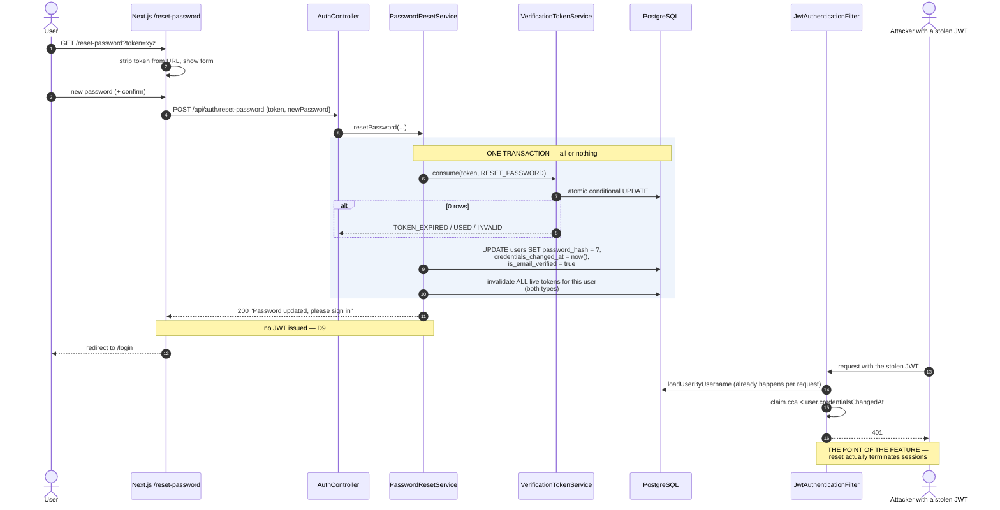

# Technical Design — Email Verification & Password Reset

**Status:** Draft for review. No code written.
**Supersedes:** the `is_email_verified` column shipped dead in V1.
**Migration:** V7 (additive only).
**Author's note:** every "current behaviour" claim below was checked against the
tree, not remembered. File and line references are given so they can be
re-checked.

---

## Contents

1. [Scope and non-goals](#1-scope-and-non-goals)
2. [Decision log](#2-decision-log)
3. [Overall architecture](#3-overall-architecture)
4. [Package structure](#4-package-structure)
5. [Database changes](#5-database-changes)
6. [Flyway V7 migration plan](#6-flyway-v7-migration-plan)
7. [Entity design](#7-entity-design)
8. [Service responsibilities](#8-service-responsibilities)
9. [Event flow](#9-event-flow)
10. [API endpoints](#10-api-endpoints)
11. [DTOs](#11-dtos)
12. [Security model](#12-security-model)
13. [Sequence diagrams](#13-sequence-diagrams)
14. [Failure scenarios](#14-failure-scenarios)
15. [Rate limiting strategy](#15-rate-limiting-strategy)
16. [Transaction boundaries](#16-transaction-boundaries)
17. [Testing strategy](#17-testing-strategy)
18. [Rollout and rollback strategy](#18-rollout-and-rollback-strategy)
19. [Configuration reference](#19-configuration-reference)
20. [Self-critique](#20-self-critique)
21. [Implementation phases](#21-implementation-phases)

---

## 1. Scope and non-goals

### In scope

- Rename `User.enabled` → `User.emailVerified`; keep `active` as the
  admin-controlled account status. Two distinct concepts, two distinct fields,
  two distinct failure responses.
- A generic `email_tokens` table serving `VERIFY_EMAIL` and `RESET_PASSWORD`.
- `credentials_changed_at` on `users`, plus a JWT claim that invalidates every
  outstanding token when credentials change.
- Email dispatch on `AFTER_COMMIT`, asynchronous, retried, metered.
- Verification link → Next.js page → `POST /api/auth/verify-email`.
- Resend verification with a per-account cooldown.
- Rate limiting on the five unauthenticated auth endpoints.
- Atomic, single-use token consumption.
- Backfill for existing users, and the email-squatting fix.

### Explicit non-goals for this feature

| Non-goal | Why | Revisit when |
|---|---|---|
| Transactional outbox for email | Adds a table, a poller and a dedupe key to solve a failure the resend button already covers | Email volume justifies at-least-once, or a compliance requirement appears |
| Multiple emails per user (GitHub model) | No product requirement; a second table now is speculative | Lawyers ask for a separate billing/contact address |
| Refresh tokens / token revocation list | `credentials_changed_at` covers the reset case, which is the one that matters | Session management becomes a product feature |
| Magic-link (passwordless) login | Different product decision, not a security fix | — |
| Changing an existing user's email | Needs its own re-verification flow | Profile editing is extended |
| Distributed rate limiting | Single instance today | A second replica is deployed — see §15 |
| Admin email-verification UI (D13) | Not required for the flow to be correct | **First follow-up after V1.** Interim remedy is the reset flow — §20 C8 |

### Requirement traceability

| # | Requirement | Section |
|---|---|---|
| 1 | Rename `enabled` → `emailVerified` | §5.1, §7.1, §21 Phase 1 |
| 2 | Keep `active` as admin status | §7.1, §12.2 |
| 3 | Generic `email_tokens` table | §5.2, §7.2 |
| 4 | `credentials_changed_at` + JWT invalidation | §5.1, §12.3 |
| 5 | AFTER_COMMIT email dispatch | §9, §16 |
| 6 | GET link → Next page → POST verify | §10, §13.2 |
| 7 | Reset reuses token infrastructure | §8.1, §13.5 |
| 8 | Resend with cooldown | §8.4, §15.3 |
| 9 | Rate limiting on four endpoints | §15 |
| 10 | Atomic token consumption | §8.2, §14 R3 |
| 11 | All identified edge cases | §14 |
| 12 | TIMESTAMPTZ | §5.2, §20 C4 |

---

## 2. Decision log

> **FROZEN — approved 2026-07-31.** Every decision below is settled. Changes
> from here require a *correctness or security* justification, not a preference.
> D3, D8, D10–D13 were confirmed or amended at approval; the amendments are
> folded into every section of this document, not merely recorded here.

| ID | Decision | Alternative rejected | Reason |
|---|---|---|---|
| D1 | One `email_tokens` table, discriminated by `type` | Two tables | Identical columns and identical lifecycle. Splitting duplicates the consume/expire logic to satisfy a purity instinct |
| D2 | HMAC-SHA256 with a server-side pepper | Plain SHA-256; BCrypt | A DB dump alone must not yield usable tokens. BCrypt is a DoS vector and buys nothing against a 256-bit random secret |
| D3 | **Hard login block when unverified (V1)** | Capability restriction (login allowed, actions gated) | Restriction needs scope claims the JWT does not have. Accepted for V1 with restriction recorded as a planned follow-up, not a rejected option — §20 C1 |
| D4 | `used_at` and `invalidated_at` as separate columns | One `used_at` for both | Distinguishes "user clicked" from "we superseded it". Needed for the click-through metric and for audit |
| D5 | Registration keeps its explicit `409 Email already exists` | Generic 202 for everything | Enumeration is already possible via login, so a generic register response costs real UX for no net secrecy. Recorded as an accepted risk in §12.5 |
| D6 | In-memory Bucket4j via Caffeine | Redis; Spring Cloud Gateway | Caffeine is already a dependency. Single instance today. Documented upgrade path in §15.4 |
| D7 | Enforcement behind a feature flag | Big-bang cut-over | Mirrors the Phase 2G dual-write discipline that worked. Lets email delivery be proven before the login gate closes |
| D8 | Squat takeover after **7 days**, plus a purge job | Purge job alone; a 24-hour threshold | Purge alone makes a squatted victim wait out the TTL. 24 hours turns a one-off block into a repeatable grief loop against slow-but-legitimate users — §20 C3 |
| D9 | Password reset does **not** auto-login | Issue a JWT on successful reset | Auto-login after a flow whose entire premise is "we are not sure who you are" is the wrong instinct. Also sidesteps the same-millisecond `cca` race |
| D10 | Email executor uses **`AbortPolicy`** | `CallerRunsPolicy` | The caller is a Tomcat request thread. `CallerRunsPolicy` lets a degraded email provider degrade the *application* — the exact coupling async exists to prevent — §20 C7 |
| D11 | Per-email rate limits live in the **service layer**; the filter is per-IP only | Both dimensions in the filter | Per-email in the filter forces `ContentCachingRequestWrapper` body caching before the controller, a known source of empty-body bugs, to re-derive a value the service already has — §20 C6 |
| D12 | **No artificial timing delay** on forgot-password | Fixed floor delay to mask account existence | Incoherent while register openly returns `409 Email already exists`. Identical body and status are kept; the timing side channel is an accepted risk — §20 C5 |
| D13 | Admin email-verification UI **deferred** | Ship it in Phase 6 | Not required for the flow to be correct. Recorded as the first follow-up because support will want it — §20 C8 |

---

## 3. Overall architecture

The feature is a new bounded context, `identity`, sitting beside `auth` rather
than inside it. `auth` keeps its current job — turn credentials into a JWT.
`identity` owns account lifecycle state: is this email real, and has this
password changed since the token was minted.

```
                    ┌──────────────────────────────────────┐
   Next.js          │  /verify-email   /reset-password     │
   (public pages)   │  (read token from query, then POST)  │
                    └───────────────┬──────────────────────┘
                                    │ HTTPS
┌───────────────────────────────────▼──────────────────────────────────┐
│ AuthController  (existing, extended)                                 │
│   register · login · verify-email · resend-verification              │
│   forgot-password · reset-password                                   │
└───────┬──────────────────────────────────────────────────────────────┘
        │  guarded by RateLimitFilter (§15)
┌───────▼────────────────┐        ┌──────────────────────────────────┐
│ AuthServiceImpl        │        │ identity                         │
│  (existing)            │        │  ├── EmailVerificationService    │
│  · register            ├───────►│  ├── PasswordResetService        │
│  · login (+gate)       │        │  └── VerificationTokenService    │
└───────┬────────────────┘        │        (issue / consume / purge) │
        │                         └───────────┬──────────────────────┘
        │ publishes                           │
        │                                     ▼
┌───────▼─────────────────────┐      ┌────────────────────┐
│ Spring ApplicationEventPub   │      │ email_tokens       │
└───────┬─────────────────────┘      │ users              │
        │  AFTER_COMMIT + @Async     └────────────────────┘
┌───────▼─────────────────────┐
│ EmailDispatchListener        │
│   └─► EmailService (iface)   │──► ResendEmailSender (prod)
│         + @Retryable         │    LoggingEmailSender (dev)
│         + failure counter    │    RecordingEmailSender (test)
└──────────────────────────────┘
```

Three properties this shape buys:

**The token service knows nothing about email.** It issues an opaque secret and
consumes it. Verification and reset are two callers of the same primitive, so
"reuse the same infrastructure" is structural rather than a convention someone
has to remember.

**Email is outside the transaction and outside the request thread.** Nothing in
the HTTP response path waits on Resend.

**`AuthServiceImpl` does not grow.** It is already handling registration,
lawyer-profile validation and login (`AuthServiceImpl.java`, 151 lines). It
gains one gate check and two delegations, not four flows.

---

## 4. Package structure

```
com.arshraj.vakilconnect
├── auth/                              (existing — minimal changes)
│   ├── controller/AuthController              + 4 endpoints
│   ├── dto/                                   + 6 request/response records
│   └── service/AuthServiceImpl                + verification gate, + delegation
│
├── identity/                          (NEW)
│   ├── entity/
│   │   ├── EmailToken
│   │   └── EmailTokenType              enum: VERIFY_EMAIL, RESET_PASSWORD
│   ├── repository/
│   │   └── EmailTokenRepository        incl. the atomic-consume @Modifying query
│   ├── service/
│   │   ├── VerificationTokenService    issue · consume · invalidate · purge
│   │   ├── EmailVerificationService    verify · resend  (orchestration)
│   │   ├── PasswordResetService        request · reset  (orchestration)
│   │   └── TokenHasher                 HMAC-SHA256 + pepper, SecureRandom
│   ├── event/
│   │   ├── EmailVerificationRequestedEvent
│   │   ├── PasswordResetRequestedEvent
│   │   └── PasswordChangedEvent        (notification only — no token)
│   ├── config/
│   │   └── IdentityProperties          @ConfigurationProperties("vakilconnect.identity")
│   └── metrics/
│       └── IdentityMetrics             MeterBinder, mirrors ReferenceMigrationMetrics
│
├── email/                             (NEW — deliberately not inside identity)
│   ├── EmailService                    interface: send(EmailMessage)
│   ├── EmailMessage                    to · subject · html · text · tag
│   ├── EmailDispatchListener           @TransactionalEventListener(AFTER_COMMIT)
│   ├── ResendEmailSender               @Profile("!dev & !test")
│   ├── LoggingEmailSender              @Profile("dev")  — prints the link
│   └── EmailProperties                 @ConfigurationProperties("vakilconnect.email")
│
└── security/jwt/                      (existing — extended)
    ├── JwtService                      + cca claim on issue, + accessor
    ├── AuthenticatedUser               NEW: UserDetails carrying credentialsChangedAt
    ├── CustomUserDetailsService        returns AuthenticatedUser
    └── JwtAuthenticationFilter         + cca staleness check
```

`email` is a sibling of `identity`, not a child. Appointment reminders and
booking confirmations will want the same sender, and burying it under
`identity` guarantees a later awkward move.

### Frontend

```
frontend/src/
├── app/(public)/
│   ├── verify-email/page.tsx          reads ?token, POSTs, shows outcome
│   ├── forgot-password/page.tsx       email form → generic confirmation
│   └── reset-password/page.tsx        reads ?token, new-password form
├── features/auth/
│   ├── api/identity-api.ts            4 new calls
│   ├── components/
│   │   ├── unverified-notice.tsx      shown on the EMAIL_NOT_VERIFIED login error
│   │   └── resend-verification-button.tsx  cooldown timer from Retry-After
│   └── schemas/                       reset + forgot zod schemas
└── lib/routes.ts                      + VERIFY_EMAIL, FORGOT_PASSWORD, RESET_PASSWORD
```

All three pages are public and must be added to the middleware allow-list.
`reset-password` and `verify-email` take the token from the query string; see
§12.4 for the referrer-leak mitigation.

---

## 5. Database changes

### 5.1 `users`

| Change | DDL | Notes |
|---|---|---|
| `credentials_changed_at` | `timestamptz NOT NULL DEFAULT now()` | Backfilled to `now()` for existing rows, which is correct: every currently-issued JWT predates it, so **all existing sessions are invalidated on deploy**. See §18.3 |
| Backfill verification | `UPDATE users SET is_email_verified = true WHERE ...` | Grandfathers pre-policy accounts — see §6 |

**The `is_email_verified` column is not renamed.** The column name is already
correct; it is the *Java field* that is wrong (`User.java:33` declares
`private boolean enabled` mapped to `is_email_verified`). The rename is a pure
Java refactor with no migration and — verified by grep — **no API impact**:
`enabled` appears in no DTO, no admin response, and no frontend type. Only
three call sites exist: `AdminBootstrapRunner:71`, `AbstractIntegrationTest:195`
and the entity's own accessors.

### 5.2 `email_tokens` (new)

```sql
CREATE TABLE email_tokens (
    id                 uuid         NOT NULL,
    user_id            uuid         NOT NULL,
    type               varchar(32)  NOT NULL,
    token_hash         varchar(64)  NOT NULL,   -- hex HMAC-SHA256
    expires_at         timestamptz  NOT NULL,
    used_at            timestamptz,             -- consumed by the user
    invalidated_at     timestamptz,             -- superseded / revoked
    created_at         timestamptz  NOT NULL DEFAULT now(),
    requested_ip       varchar(45),             -- IPv6-safe; audit only
    requested_user_agent text,
    consumed_ip        varchar(45),

    CONSTRAINT pk_email_tokens PRIMARY KEY (id),
    CONSTRAINT fk_email_tokens_user
        FOREIGN KEY (user_id) REFERENCES users(id) ON DELETE CASCADE,
    CONSTRAINT ck_email_tokens_type
        CHECK (type IN ('VERIFY_EMAIL', 'RESET_PASSWORD')),
    CONSTRAINT ck_email_tokens_terminal_state
        CHECK (used_at IS NULL OR invalidated_at IS NULL)
);
```

**Indexes**

```sql
-- Lookup path. Unique because a hash collision would be a correctness bug.
CREATE UNIQUE INDEX uq_email_tokens_hash ON email_tokens (token_hash);

-- THE core invariant: at most one live token per (user, type).
-- Makes "invalidate the old one before issuing a new one" a database rule
-- rather than a service-layer convention. Same technique as V2.
CREATE UNIQUE INDEX uq_email_tokens_live
    ON email_tokens (user_id, type)
    WHERE used_at IS NULL AND invalidated_at IS NULL;

-- Cooldown check: newest request per (user, type).
CREATE INDEX ix_email_tokens_user_type_created
    ON email_tokens (user_id, type, created_at DESC);

-- Purge job.
CREATE INDEX ix_email_tokens_expires
    ON email_tokens (expires_at) WHERE used_at IS NULL AND invalidated_at IS NULL;
```

`uq_email_tokens_live` is the load-bearing one. It means a resend cannot
accidentally leave two valid links alive, even under concurrent requests — the
second insert fails with a constraint violation rather than succeeding
silently.

**Why `varchar(64)` and not `bytea`:** hex is greppable in psql during an
incident, indexes identically, and costs 32 bytes per row. Not worth the
ergonomic loss.

**Why `varchar(64)` and not `char(64)`** *(corrected during Phase 1 review)*:
`char(n)` is blank-padded, has no performance advantage in PostgreSQL, and
would not match Hibernate's `varchar` mapping for a `String` field — so
`ddl-auto: validate` would have failed the moment the entity was introduced. It
also contradicted V1's own documented contract, `String (len=N) -> varchar(N)`.

**Why `text` and not `varchar(255)` for the user agent** *(corrected during
Phase 1 review)*: real UA strings routinely exceed 255 characters, and
`value too long` would abort the enclosing registration transaction. In
PostgreSQL `text` and `varchar` perform identically, so the bound bought
nothing but an outage.

**Why `varchar(45)` and not `inet`:** the value is only ever logged and
displayed, never subnet-matched. `inet` would force a Hibernate custom type for
no gain.

### 5.3 Timestamps

All new columns are `timestamptz`. The existing V1 columns are
`timestamp(6)` without zone — this design does **not** convert them (out of
scope, and a rewrite of every table), but it does mean the codebase will have
both. That inconsistency is called out in §20 C4.

---

## 6. Flyway V7 migration plan

Single migration, additive only, no destructive statements. Runs inside one
transaction — Postgres DDL is transactional, so a failure at any step leaves
the schema untouched.

```sql
-- V7__email_verification_and_password_reset.sql

-- 1 ── credentials_changed_at
--
-- DEFAULT now() means every existing row gets the deploy timestamp, which
-- invalidates every JWT issued before the deploy. That is intentional and is
-- the safe direction: the alternative (backdating to created_at) would leave
-- pre-existing tokens valid against a mechanism that had never been tested.
ALTER TABLE users
    ADD COLUMN credentials_changed_at timestamptz NOT NULL DEFAULT now();

-- 2 ── Grandfather existing accounts
--
-- is_email_verified shipped in V1 but nothing ever wrote it except
-- AdminBootstrapRunner, so every self-registered user currently reads false.
-- Enabling the login gate without this backfill would lock out 100% of the
-- existing user base for a policy that did not exist when they signed up.
--
-- Deliberately NOT scoped by created_at. Flyway's checksum and history table
-- are the guarantee that this runs exactly once; a created_at predicate would
-- have to hardcode an environment-specific timestamp to mean anything, and a
-- comment claiming protection the SQL does not provide is worse than none.
--
-- Users who register AFTER this migration but BEFORE verification emails go
-- live are not covered and cannot be - they do not exist yet. That cohort is
-- an operational step on the cut-over checklist, not a schema concern.
UPDATE users
   SET is_email_verified = true
 WHERE is_email_verified = false;

-- 3 ── email_tokens  (DDL exactly as §5.2)
CREATE TABLE email_tokens (...);
CREATE UNIQUE INDEX uq_email_tokens_hash ...;
CREATE UNIQUE INDEX uq_email_tokens_live ...;
CREATE INDEX ix_email_tokens_user_type_created ...;
CREATE INDEX ix_email_tokens_expires ...;
```

### Compatibility properties

| Property | Holds? | Why it matters |
|---|---|---|
| Old jar runs against V7 schema | **Yes** | Hibernate `validate` ignores extra tables and extra columns. An app rollback needs no DB rollback |
| V7 runs against a V6 database | Yes | Purely additive |
| Re-runnable | N/A | Flyway checksums it; step 2 is idempotent anyway |
| Locks | Brief | `ADD COLUMN` with a constant default is metadata-only on PG 11+. The `UPDATE` rewrites every user row — fine at current scale, worth a note above ~1M users |

### What is deliberately *not* in V7

No `NOT NULL` added to anything existing. No column dropped. No type changed.
The one and only irreversible act is the `UPDATE` in step 2, and the
pre-migration backup covers it.

---

## 7. Entity design

### 7.1 `User` (modified)

| Field | Column | Change |
|---|---|---|
| `emailVerified` | `is_email_verified` | **Renamed from `enabled`.** Default `false`. Set `true` only by verification or bootstrap |
| `active` | `active` | Unchanged. Admin-controlled. **Not** touched by this feature |
| `credentialsChangedAt` | `credentials_changed_at` | New. `Instant`. Written on password reset and any future password change |

The rename is the highest-value change in the whole design and the reason it
comes first in §21. Today `JwtAuthenticationFilter:72` calls
`userDetails.isEnabled()` (Spring's `UserDetails`, backed by `active`) in the
same request path where `user.isEnabled()` would mean `is_email_verified`. Two
identically-named methods, opposite meanings, one filter. That is a production
lockout waiting for a tired afternoon.

After the rename the vocabulary is unambiguous:

| Concept | Field | Set by | Login failure |
|---|---|---|---|
| Email proven | `emailVerified` | The user, via link | `403 EMAIL_NOT_VERIFIED` |
| Account permitted | `active` | An admin | `401 ACCOUNT_DISABLED` |

### 7.2 `EmailToken` (new)

| Field | Type | Notes |
|---|---|---|
| `id` | `UUID` | |
| `user` | `@ManyToOne(fetch = LAZY)` | `open-in-view: false` is already set, so every access must be inside a transaction |
| `type` | `EmailTokenType` | `@Enumerated(STRING)` — matches the CHECK constraint |
| `tokenHash` | `String` | Hex HMAC. **Never** the raw token |
| `expiresAt` | `Instant` | |
| `usedAt` / `invalidatedAt` | `Instant` (nullable) | Mutually exclusive by CHECK |
| `createdAt` | `Instant` | |
| `requestedIp` / `requestedUserAgent` / `consumedIp` | `String` | Audit |

Derived, not persisted: `isLive() = usedAt == null && invalidatedAt == null &&
expiresAt.isAfter(now)`.

**The raw token exists only in memory,** for the duration of one request, and
is passed to the event listener. `EmailToken` has no field for it and
`toString()` must not be Lombok-generated on any object that carries it — see
§12.6.

---

## 8. Service responsibilities

### 8.1 `VerificationTokenService` — the shared primitive

Neither flow-specific service touches the table directly.

| Operation | Contract |
|---|---|
| `issue(user, type)` | Invalidate any live token for `(user, type)`, generate 32 bytes from `SecureRandom`, Base64-URL encode, HMAC it, insert, return **the raw token**. Caller is responsible for never persisting or logging it |
| `consume(rawToken, type)` | Hash, then a single atomic conditional `UPDATE`. Returns the owning user or throws a typed failure. See §14 R3 |
| `invalidateAll(user, type)` | Bulk `UPDATE ... SET invalidated_at = now()`. Called on password change |
| `lastRequestedAt(user, type)` | Newest `created_at`, for the cooldown check |
| `purgeExpired()` | `@Scheduled` daily. Deletes rows terminal for > 30 days |

`issue` and the invalidate-then-insert are one transaction. Under a concurrent
double-request, `uq_email_tokens_live` makes one of them fail; the service
translates that constraint violation into the cooldown response rather than a
500.

### 8.2 `EmailVerificationService`

- `verify(rawToken)` → consume, set `emailVerified = true`, publish nothing.
  Idempotency is discussed in §14 R4.
- `resend(email)` → cooldown check, issue, publish
  `EmailVerificationRequestedEvent`. **Always returns the same response** for
  unknown email, already-verified, and success (§12.5).

### 8.3 `PasswordResetService`

- `requestReset(email)` → issue + publish. Constant response.
- `resetPassword(rawToken, newPassword)` → in **one** transaction: consume the
  token, encode and set the new hash, set `credentials_changed_at = now()`,
  `invalidateAll(user, RESET_PASSWORD)` **and** `invalidateAll(user,
  VERIFY_EMAIL)`, then publish `PasswordChangedEvent` for the notification
  email.
  - Also sets `emailVerified = true`. Reaching a reset link proves control of
    the mailbox just as well as a verification link does; leaving it false
    would strand the user in a loop.
  - Does **not** issue a JWT (D9).

### 8.4 Cooldown vs rate limit

Two different mechanisms, deliberately:

| | Cooldown | Rate limit |
|---|---|---|
| Keyed on | Account | IP and email |
| Backed by | `email_tokens.created_at` (durable) | In-memory bucket (volatile) |
| Survives restart | Yes | No |
| Purpose | One email per account per minute | Abuse and cost control |
| Response | `429` + `Retry-After` | `429` + `Retry-After` |

The cooldown is durable on purpose: an attacker who can restart the app — or
simply wait for a deploy — must not be able to reset the volatile buckets and
mail-bomb an account.

### 8.5 `EmailService`

A single-method interface — send an `EmailMessage` — so the provider is a
detail. Three implementations selected by profile. `LoggingEmailSender` printing the
full verification URL to the console in `dev` removes the need for a real inbox
during local development — and must be `@Profile("dev")` so it can never be
selected in production.

---

## 9. Event flow

### Why events rather than a direct call

Registration is `@Transactional` (`AuthServiceImpl:25`, and note it is
`jakarta.transaction.Transactional`, not Spring's). Sending email inside that
transaction produces two failure modes:

1. A rollback after a successful send leaves a live verification link for a
   user row that no longer exists.
2. Resend's HTTP latency is added to the time a Hikari connection is held. A
   provider slowdown becomes connection-pool exhaustion.

### The chain

```
AuthServiceImpl.register()                     [TX open]
    ├── save user (+ lawyer profile)
    ├── VerificationTokenService.issue()        → raw token in memory
    └── publisher.publishEvent(EmailVerificationRequestedEvent)
                                               [TX commits]
                                                    │
   @TransactionalEventListener(phase = AFTER_COMMIT)│
   @Async("emailTaskExecutor")                      ▼
                              EmailDispatchListener.on(event)
                                    ├── render template
                                    ├── EmailService.send()   @Retryable ×3
                                    └── on exhaustion: @Recover
                                          ├── log ERROR (no token in the message)
                                          └── metrics counter++
```

### Details that matter

**`@Async` is not optional.** `AFTER_COMMIT` listeners run synchronously on the
calling thread by default, so without it the HTTP response still waits for
Resend. Requires `@EnableAsync` and an explicit bounded executor — never the
default `SimpleAsyncTaskExecutor`, which spawns an unbounded thread per event.

**Executor: core 2, max 5, queue 100, `AbortPolicy` (D10).** When the queue is
full the task is rejected, counted on
`email_send_total{outcome="rejected"}`, and dropped.

`CallerRunsPolicy` was rejected: the caller here is a Tomcat request thread, so
under a Resend slowdown request threads would be consumed sending email and a
degraded provider would become a degraded application — precisely the coupling
the async design exists to prevent. Dropping is also consistent with R7, which
already accepts at-most-once delivery, and with resend being a first-class
recovery path. Rejections are visible in metrics, so "email silently vanished"
is not a possible state.

**Events carry the raw token.** There is no other option — the token is not
recoverable from the database by design. Consequences: the event class must not
be a `record` with a default `toString()`, must never be passed to a logger,
and must not be serialised to any durable event store.

**Failure after commit is not rolled back.** By construction. The user exists,
the token exists, the email did not send. Recovery is the resend button, which
is why resend is a first-class endpoint rather than an afterthought.

**Metrics.** `IdentityMetrics` as a `MeterBinder`, following the existing
`ReferenceMigrationMetrics` pattern:

| Meter | Type | Purpose |
|---|---|---|
| `vakilconnect_identity_email_send_total{type,outcome}` | Counter | Delivery success/failure by flow |
| `vakilconnect_identity_token_consumed_total{type,outcome}` | Counter | `outcome` ∈ ok, expired, not_found, already_used |
| `vakilconnect_identity_rate_limit_rejected_total{endpoint}` | Counter | Abuse signal |
| `vakilconnect_identity_unverified_users` | Gauge | Cached like the reconciliation report — no per-scrape query |

The first two are what tell you, on the morning after launch, whether the
problem is delivery or the token logic.

---

## 10. API endpoints

All six are public and must be added to the `permitAll` block in
`SecurityConfig` (currently lines 62–68 list only `register`, `login` and the
springdoc paths).

| Method | Path | Auth | Success | Notes |
|---|---|---|---|---|
| POST | `/api/auth/register` | none | 201 | Existing. Now also issues a token |
| POST | `/api/auth/login` | none | 200 | Existing. Now gated |
| POST | `/api/auth/verify-email` | none | 200 | Body carries the token, never the URL |
| POST | `/api/auth/resend-verification` | none | 202 | Constant response |
| POST | `/api/auth/forgot-password` | none | 202 | Constant response |
| POST | `/api/auth/reset-password` | none | 200 | Consumes token, bumps `cca` |

**No `GET /api/auth/verify-email`.** The email link points at the Next.js page
`https://<app>/verify-email?token=…`, which POSTs to the API. This is not REST
pedantry: Outlook Safe Links, corporate mail scanners and browser prefetchers
fetch links before a human clicks them. A mutating GET means a security
appliance consumes the token and the user sees "invalid link". This is the most
common real-world failure of hand-rolled verification flows.

### Error codes

`ErrorResponse` (`common/exception/ErrorResponse.java`) currently has no
machine-readable code field — only `error` (the HTTP reason phrase) and a prose
`message`. Rather than have the frontend pattern-match English, **add a nullable
`code` field**. Nullable keeps every existing response byte-compatible: Jackson
omits it when null for all current handlers.

| `code` | HTTP | Meaning |
|---|---|---|
| `EMAIL_NOT_VERIFIED` | 403 | Login blocked; show the resend UI |
| `ACCOUNT_DISABLED` | 401 | Admin deactivation. Distinct on purpose |
| `TOKEN_INVALID` | 400 | Not found, or wrong type |
| `TOKEN_EXPIRED` | 410 | Offer to resend |
| `TOKEN_ALREADY_USED` | 409 | See §14 R4 |
| `RATE_LIMITED` | 429 | With `Retry-After` |
| `COOLDOWN_ACTIVE` | 429 | With `Retry-After` |

Separating `TOKEN_EXPIRED` (410) from `TOKEN_INVALID` (400) leaks only whether
a token *was* valid, which the holder of the token already knows. The UX gain —
"this link expired, get a new one" instead of "invalid" — is worth it.

---

## 11. DTOs

Records, `jakarta.validation` annotated, matching the existing `auth/dto` style.

**Requests**

| DTO | Fields | Validation |
|---|---|---|
| `VerifyEmailRequest` | `token` | `@NotBlank`, `@Size(max = 128)` |
| `ResendVerificationRequest` | `email` | `@NotBlank`, `@Email` |
| `ForgotPasswordRequest` | `email` | `@NotBlank`, `@Email` |
| `ResetPasswordRequest` | `token`, `newPassword` | `@NotBlank` ×2; password rules identical to `RegisterRequest` |

**Responses**

| DTO | Fields | Used by |
|---|---|---|
| `VerificationResponse` | `verified`, `message` | verify-email |
| `AcknowledgementResponse` | `message` | resend, forgot-password |
| `PasswordResetResponse` | `message` | reset-password |

`AcknowledgementResponse` returns an identical body for every input — that is
the whole point of it existing rather than reusing something status-bearing.

**Changed:** `LoginResponse` is unchanged. `RegisterResponse` keeps its shape;
only the `message` string changes to mention the email, which is not a contract
change since it was never machine-readable.

**Password rules must be extracted.** `ResetPasswordRequest` and
`RegisterRequest` must not drift, or users will set passwords at reset that
they could not have set at registration. Shared constant + shared annotation.

---

## 12. Security model

### 12.1 Token generation

| Property | Value | Rationale |
|---|---|---|
| Source | `SecureRandom`, 32 bytes | 256 bits. **Not** `UUID.randomUUID()` — 122 bits and no CSPRNG guarantee |
| Encoding | Base64-URL, no padding | 43 chars, safe in a query string unescaped |
| At rest | HMAC-SHA256(token, pepper), hex | A DB dump alone is not enough to forge a link |
| Comparison | Lookup by indexed hash | Constant-time comparison is not meaningfully relevant when the lookup is an index probe on a 256-bit value; the usual advice targets fetch-then-`equals` |

**Why HMAC and not bare SHA-256.** A bare hash of an unsalted high-entropy
token is not brute-forceable, so the marginal gain is narrow — but it is real:
a read-only SQL injection or a leaked backup yields nothing usable without the
pepper, which lives in the environment rather than the database. Cost is one
config value.

**Why not BCrypt.** Slow-by-design hashing exists to protect low-entropy
secrets. Against 256 bits of randomness it buys nothing, adds a CPU-exhaustion
vector on an unauthenticated endpoint, and silently truncates at 72 bytes.

`TOKEN_PEPPER` is a new required environment variable with no default, mirroring
the `JWT_SECRET` fail-fast precedent. Rotating it invalidates all outstanding
links — acceptable, and documented.

### 12.2 The login gate

Checked **explicitly in `AuthServiceImpl.login()` after
`authenticationManager.authenticate()` succeeds** — never folded into
`UserDetails.disabled()`.

Reason: `CustomUserDetailsService:33` already maps `.disabled(!user.isActive())`.
Adding verification to the same flag collapses "an admin deactivated you" and
"you have not clicked the link" into one indistinguishable `DisabledException`,
and the frontend cannot then decide whether to show a resend button or a
support link.

Ordering is deliberate: authenticate first, *then* check verification. Checking
verification first would let an attacker probe which addresses have unverified
accounts without knowing any password.

### 12.3 JWT invalidation via `credentials_changed_at`

Today `JwtService.generateToken()` emits only `sub`, `iat` and `exp`, and there
is no revocation of any kind. A password reset therefore does not end an
attacker's session — for up to 24 hours (`JWT_EXPIRATION` default). This is the
most serious gap the feature closes.

**Mechanism**

1. `generateToken` adds a `cca` claim: `credentials_changed_at` as **epoch
   milliseconds**.
2. `CustomUserDetailsService` returns a new `AuthenticatedUser implements
   UserDetails` exposing `credentialsChangedAt`. (Spring's built-in
   `User.withUsername()` builder cannot carry it.)
3. `JwtAuthenticationFilter` rejects when `claim.cca < user.credentialsChangedAt`.

**Why this is nearly free:** the filter already calls
`loadUserByUsername()` on every request (`JwtAuthenticationFilter:54–55`), so
the user row is already being read. The check adds a field comparison, not a
query.

**Why milliseconds, not seconds.** With second granularity, a reset and a
subsequent login inside the same second produce `claim.cca == stored`, and the
`<` comparison would admit a token minted in that same second. Milliseconds
make the window practically unreachable, and D9 (no auto-login after reset)
removes the only realistic path to it.

**Deliberate consequence:** the V7 default of `now()` invalidates every
currently-issued JWT at deploy time. Every logged-in user is signed out once.
See §18.3.

### 12.4 Token exposure in URLs

The token is in the query string of the *frontend* URL, which is unavoidable
for an email link. Mitigations:

| Vector | Mitigation |
|---|---|
| `Referer` leakage to third parties | `Referrer-Policy: strict-origin-when-cross-origin` is already set in `next.config.ts` (Phase B) |
| Browser history | Single-use + short TTL. The page should also `history.replaceState` the token out of the URL after reading it |
| Server access logs | The token never reaches the API in a URL — only in a POST body |
| Analytics scripts | None currently loaded. If one is ever added, `verify-email` and `reset-password` must be excluded |

### 12.5 Enumeration posture

Stated explicitly so it is a decision rather than an accident.

| Endpoint | Leaks existence? | Why |
|---|---|---|
| `register` | **Yes** — `409 Email already exists` | Accepted (D5). Existing behaviour, `AuthServiceImpl:52`. A generic response would break the takeover UX for no net gain |
| `login` | **Yes** — `EMAIL_NOT_VERIFIED` vs bad credentials | Accepted. Follows from D3 and from the register leak already existing |
| `forgot-password` | **No** | Constant 202 |
| `resend-verification` | **No** | Constant 202 |
| `verify-email` / `reset-password` | No | Token-scoped |

Coherent story: enumeration is possible via the account-creation surface and we
accept that, but we do not *amplify* it into an endpoint that also sends mail.
If this is later judged unacceptable, the fix is register → 202 generic, and it
is a frontend change more than a backend one.

### 12.6 Secret handling checklist

- `EmailToken` has no raw-token field.
- Event objects carrying the raw token: explicit `toString()` that redacts. No
  Lombok `@Data`, no `record` default.
- `@Retryable` failure logs must include the token *id*, never the token.
- The verification URL is assembled in the listener, not the service, so the
  raw token has the narrowest possible reach.
- `LoggingEmailSender` prints the full link — `@Profile("dev")` only.

### 12.7 CSRF

`csrf.disable()` (`SecurityConfig:49`) remains correct: the JWT travels in the
`Authorization` header, and all six endpoints are either unauthenticated or
token-scoped, so there is no ambient credential for a cross-site POST to abuse.
Note this becomes false the day the token moves to an httpOnly cookie
(Phase G) — the two changes must not be made independently.

---

## 13. Sequence diagrams

### 13.1 Registration



The response returns at step 15 without waiting for step 17. A Resend outage
degrades to "no email arrived", never to "registration failed".

### 13.2 Email verification



Steps 7–8 are the double-click fix: the conditional `UPDATE` is the test *and*
the write, so two concurrent requests cannot both see `used_at IS NULL`.
Exactly one gets `rows affected = 1`.

### 13.3 Login



Verification is checked *after* authentication (step 13), so an unauthenticated
prober cannot use the endpoint to discover which addresses are unverified
beyond what the register endpoint already reveals.

### 13.4 Forgot password



Every branch returns the same body and the same status.

The four branches **do** differ observably in *timing* — a real account writes
a token row, an unknown one returns immediately — and this design accepts that
(D12). No artificial delay is added. Padding the response would spend latency on
every request to close a side channel that `POST /register` already leaves wide
open with `409 Email already exists` (§12.5). If enumeration later becomes
unacceptable, the fix is at register, and only then is timing work worth doing.

### 13.5 Password reset



The last three steps are why `credentials_changed_at` exists. Without it, the
reset completes and the attacker keeps access until the 24-hour expiry.

---

## 14. Failure scenarios

Every row is a test case in §17.

| ID | Scenario | Behaviour | Enforced by |
|---|---|---|---|
| **R1** | **Email squatting** — attacker registers `victim@x.com` and never verifies, blocking the real owner forever via `uq_users_email` | Re-registration **takes over** the row when *all* hold: not verified, **created more than 7 days ago** (`TAKEOVER_THRESHOLD`, D8 — deliberately much longer than the 24 h token TTL), role `CLIENT`, and no dependent rows. Overwrites name/phone/password hash, resets `credentials_changed_at`, invalidates outstanding tokens, issues a fresh one. `LAWYER` accounts are excluded because a `lawyer_profiles` row with a unique `bar_council_number` already exists. Takeover is rate-limited separately from registration so it cannot be driven in a loop | Service check + §14 R2 purge |
| **R2** | Squatted rows accumulate | Daily `@Scheduled` purge of unverified accounts older than 30 days with no dependent rows. Housekeeping; R1 is the immediate remedy | `purgeExpired()` |
| **R3** | **Double-click race** — user clicks the link twice, or the mail client prefetches while the user clicks | Single conditional `UPDATE ... WHERE used_at IS NULL AND invalidated_at IS NULL AND expires_at > now()`; the row count *is* the decision. Never read-then-write | Database |
| **R4** | Verification link clicked twice, seconds apart | Second attempt returns `409 TOKEN_ALREADY_USED`. **The frontend renders this as success** when the account is already verified, because the user's mental model is "did it work", not "was this the first click" | FE mapping |
| **R5** | **Replay after expiry** | `expires_at > now()` is part of the same conditional UPDATE, evaluated in Postgres against `now()`. No application clock involved, so app/DB clock skew cannot extend a token's life | Database |
| **R6** | **Resend failure** — Resend returns 429/5xx | 3 attempts, exponential backoff, inside the async listener. On exhaustion: ERROR log (token id, never the token) + `email_send_total{outcome="failure"}`. Token stays valid; user recovers via resend | `@Retryable` / `@Recover` |
| **R7** | Process dies between COMMIT and send | Email is lost. Accepted (no outbox — see §1). Detectable as a gap between `token_issued` and `email_send_total`. Remedy is resend | Accepted |
| **R8** | **Timing oracle** on forgot-password | Identical body and status on all branches. **No artificial delay** (D12) — a real account writes a token row and is therefore measurably slower. Accepted, because `POST /register` already returns `409 Email already exists` outright, so the channel is redundant. Revisit only if register is made generic | Accepted risk — §12.5 |
| **R9** | **Existing users locked out** at cut-over | V7 step 2 backfills every existing row to verified, and the gate additionally ships behind `enforced: false` | Migration + flag |
| **R10** | Admin locked out | `AdminBootstrapRunner:71` already sets the flag true, and the runner is idempotent on email. Unaffected | Existing |
| **R11** | Concurrent resend requests | `uq_email_tokens_live` makes the second insert fail. The service catches the constraint violation and returns `COOLDOWN_ACTIVE`, not a 500 | Database + handler |
| **R12** | Reset token used after the password already changed by another route | `invalidateAll` on every password change means the old link is dead. Returns `TOKEN_INVALID` | Service |
| **R13** | User verifies, then an admin deactivates them | `active = false` wins. Login returns `ACCOUNT_DISABLED`, distinct from `EMAIL_NOT_VERIFIED` | §12.2 |
| **R14** | Rate limiter counts every user as one IP | `server.forward-headers-strategy: framework` **must** be set — it currently is not. Without it, behind a reverse proxy every request carries the proxy's IP and one abuser rate-limits the entire user base | Config — §15.5 |
| **R15** | Token pepper rotated | Every outstanding link dies immediately. Acceptable; documented in `.env.example` alongside the `JWT_SECRET` rotation note |  Docs |
| **R16** | Very long token in the request body | `@Size(max = 128)` on the DTO. A 43-char token cannot legitimately exceed it; the bound stops oversized payloads reaching the HMAC | Validation |
| **R17** | Unverified `LAWYER` publicly visible | **Already prevented for search:** `LawyerRepository.search` requires `l.verified = true` (admin approval), and `Lawyer.verified` defaults false. The unguarded path is `GET /api/lawyers/{id}`, which is pre-existing and low severity. The genuine gap is that admins approve lawyers without seeing email status — see §20 C2 | Existing gate + C8 |

---

## 15. Rate limiting strategy

### 15.1 Two enforcement points, deliberately (D11)

| | Per-IP | Per-email |
|---|---|---|
| Where | `RateLimitFilter`, a `OncePerRequestFilter` before `JwtAuthenticationFilter` | Inside `EmailVerificationService` / `PasswordResetService` / `AuthServiceImpl` |
| Input | `request.getRemoteAddr()` — available without parsing anything | The already-validated, already-normalised email |
| Rejects with | `429` written directly by the filter | `RateLimitedException` → `GlobalExceptionHandler` |

Both share one Bucket4j `ProxyManager` over a Caffeine cache. Caffeine and
`spring-boot-starter-cache` are already dependencies (`pom.xml`), so this adds
one library, not a service. Buckets are keyed `endpoint:dimension:value` and
evicted after 2× the refill window. Both paths return `Retry-After` in seconds
and `code: RATE_LIMITED`.

**Why per-email is not in the filter.** It would need the request body before
the controller, forcing a `ContentCachingRequestWrapper` — a well-known source
of "empty request body" bugs — to re-derive a value the service is about to
have anyway, with its own validation and normalisation already applied. The
service also has the *correct* email: the filter would be limiting on the raw
string, so `Foo@Bar.com` and `foo@bar.com` would get separate buckets and the
limit would be trivially bypassed by changing case.

Writing both against `ProxyManager` from day one is what keeps the §15.4 Redis
swap a configuration change.

### 15.2 Limits

| Endpoint | Per IP (filter) | Per email (service) | Rationale |
|---|---|---|---|
| `POST /register` | 5 / hour | — | Account-farming brake |
| `POST /register` (takeover path) | — | 3 / day | D8: stops the 7-day takeover being driven in a loop against one victim |
| `POST /login` | 10 / 15 min | 5 / 15 min | Per-email is the credential-stuffing defence; per-IP alone is defeated by a proxy pool |
| `POST /forgot-password` | 5 / hour | 3 / hour | Both dimensions: protects the mailbox owner *and* the Resend quota |
| `POST /resend-verification` | 5 / hour | 3 / hour | Plus the durable 60 s cooldown (§8.4) |
| `POST /verify-email` | 20 / hour | — | Token guessing is infeasible at 256 bits; this only bounds cost |
| `POST /reset-password` | 20 / hour | — | Same |

Per-email limits are checked **before** any email is issued and **after**
authentication where authentication applies, so a limiter rejection can never
be used as an oracle that a password was correct.

### 15.3 Cooldown, separately

60 seconds between verification emails for the same account, computed from
`MAX(email_tokens.created_at)`. Durable, so a restart or deploy cannot reset it
(§8.4). Response carries `Retry-After`, which the frontend renders as a
countdown on the resend button.

### 15.4 Known limitation: single instance

> **Two things in this feature assume one instance. Both are here so they are
> found together when a second replica is added.**
>
> 1. **Rate-limit buckets are in-memory** (this section).
> 2. **The token purge job is `@Scheduled`** (C9) and will run on every replica
>    concurrently. The deletes are idempotent so nothing breaks, but it is
>    wasteful; disable it on all but one instance via `identity.purge.enabled`
>    until a leader-election or a distributed lock exists.

In-memory buckets are per-JVM. With two replicas the effective limit doubles
and a restart clears all counters. Acceptable now — the deployment is a single
jar (`DEPLOYMENT.md`) — and dishonest to leave unstated.

Upgrade path when a second replica appears: `bucket4j-redis`, same
`ProxyManager` abstraction, configuration change rather than a rewrite. **Both**
the filter and the service-layer checks must be written against Bucket4j's
`ProxyManager` from day one so the backend swap is genuinely a config change.

The durable cooldown is what keeps the *most* abusable action — mailing a third
party — bounded regardless of instance count. That was a factor in making it
durable.

### 15.5 Prerequisite

```yaml
server:
  forward-headers-strategy: framework
```

Not currently set. Without it, `request.getRemoteAddr()` behind the reverse
proxy in `DEPLOYMENT.md` returns the proxy IP for every request, so the per-IP
limit becomes a global limit and the first abuser locks out everyone. This is a
correctness prerequisite, not a tuning knob.

Note the corollary: `X-Forwarded-For` is client-controlled unless the proxy
overwrites it. The deployment must be configured so the proxy *replaces* rather
than appends, otherwise per-IP limits are trivially bypassed by spoofing.

---

## 16. Transaction boundaries

### The rule

**Token issuance is inside the transaction. Email dispatch is outside it.**

Everything else follows.

| Operation | Boundary | Contents | Isolation |
|---|---|---|---|
| `register` | One TX | user insert (+ lawyer profile) + token insert + event publish | Default (READ COMMITTED) |
| `verifyEmail` | One TX | atomic token consume + `is_email_verified = true` | Default; correctness from the conditional UPDATE, not isolation |
| `resendVerification` | One TX | cooldown read + invalidate + insert + publish | Default; `uq_email_tokens_live` handles the race |
| `forgotPassword` | One TX | lookup + invalidate + insert + publish | Default |
| `resetPassword` | One TX | consume + password + `credentials_changed_at` + invalidate all | Default |
| Email send | **No TX** | Async, after commit | — |
| `purgeExpired` | Own TX | Bulk delete, batched | Default |

### Specific hazards

**`jakarta.transaction.Transactional`, not Spring's.** `AuthServiceImpl:15`
imports the Jakarta annotation. It works, but it does not support `readOnly`
and its `rollbackOn` semantics differ from Spring's `rollbackFor`. New identity
services should use `org.springframework.transaction.annotation.Transactional`
consistently; migrating `AuthServiceImpl` is optional and out of scope.

**`@TransactionalEventListener` silently does nothing without a transaction.**
If a caller invokes an issuing service outside a transaction, the event is
published and dropped with no error. Every publishing path must be
`@Transactional`, and there should be a test that asserts the listener fires —
otherwise this fails silently in production only.

**Self-invocation defeats proxying.** `resetPassword` calling
`this.invalidateAll(...)` bypasses the proxy. Because both live in one
transaction here it is harmless today, but it is the standard trap; keep the
call going through the injected `VerificationTokenService` bean.

**`open-in-view: false` is already set.** `EmailToken.user` is LAZY, so the
listener must receive plain values (email, name, raw token) in the event — never
the entity. Touching `token.getUser().getEmail()` in the listener throws
`LazyInitializationException` because the transaction has, by definition,
already committed.

**The password encoder must run inside the transaction but is CPU-bound.**
BCrypt at the default strength takes ~100 ms, held while a DB connection is
open. Acceptable at this scale; worth remembering when tuning the pool.

---

## 17. Testing strategy

Integration-first, matching the existing suite: 12 `*IT.java` classes on a
singleton Testcontainers Postgres, real Flyway, `ddl-auto: validate`.

### 17.1 Constraints inherited from the existing harness

- **One shared database across all test classes.** No assertion may depend on
  an absolute row count. Use `distinctEmail()` (already in
  `AbstractIntegrationTest`) for per-call unique addresses.
- **`@Async` makes assertions racy.** Bind a synchronous executor in the test
  profile so `AFTER_COMMIT` listeners run inline. Without this the email
  assertions are flaky in CI and pass locally — the worst failure mode.
- **`RecordingEmailSender`** as a `@TestConfiguration` bean: captures
  `EmailMessage` objects in a list, exposes the raw token to the test. This is
  the only legitimate place the raw token is readable after issuance.

### 17.2 New test classes

| Class | Covers |
|---|---|
Six classes, not eight — `TokenLifecycleIT` and `EmailDispatchIT` are merged
per C11 to hold down suite wall-clock time.

| Class | Phase | Covers |
|---|---|---|
| `EmailVerificationIT` | 4 | Happy path; expired; already used; unknown token; wrong type at the wrong endpoint; verified user can then log in. **Merged from `TokenLifecycleIT`:** issue → invalidate-on-reissue; `uq_email_tokens_live` violation surfaces as `COOLDOWN_ACTIVE` not 500; purge deletes only terminal rows |
| `PasswordResetIT` | 6 | Happy path; expired; reused; **`cca` invalidation of a previously issued JWT**; reset also sets `emailVerified`. **Merged from `EmailDispatchIT`:** listener fires only after commit; a rolled-back registration sends nothing; retry exhaustion increments the failure counter |
| `TokenConcurrencyIT` | 2 | Two threads, `CountDownLatch`, same token → exactly one 200 and one 409. **The single most important test in the feature**, and the one that must never be merged into another class |
| `RateLimitIT` | 7 | Filter (per-IP) exhaustion returns 429 + `Retry-After`; service (per-email) exhaustion returns 429 through `GlobalExceptionHandler`; the two dimensions are independent; case-variant emails share one bucket (D11) |
| `SquatTakeoverIT` | 4 | Takeover succeeds for an unverified CLIENT older than `TAKEOVER_THRESHOLD`; refused for a verified account, an account inside the 7-day window, and a LAWYER with a profile; takeover is itself rate-limited |
| `LoginGateIT` | 8 | Unverified → 403 `EMAIL_NOT_VERIFIED`; inactive → 401 `ACCOUNT_DISABLED`; **both distinguishable**; verified+active → 200; gate is inert when `enforced: false` |

### 17.3 Unit tests

Only where logic is genuinely pure and worth isolating:

- `TokenHasher` — same input yields the same HMAC; different peppers yield
  different hashes; output is 64 hex chars.
- Cooldown arithmetic — boundary at exactly 60 s, with an injected `Clock`
  (the pattern `ReferenceMigrationMetrics` already uses).

### 17.4 Regression tests for existing behaviour

The rename and the login gate touch shipped code. These must be added *before*
the change, and must pass unchanged after:

- Every existing `AuthControllerIT` case still passes with the gate disabled.
- `ErrorResponse` for all current handlers serialises **without** a `code` key
  (the nullable-field compatibility claim in §10 must be proven, not asserted).
- `AdminBootstrapRunner` still produces a loginable admin.

### 17.5 Frontend

Vitest, following Phase F (pure logic only, no snapshots):

- Token extraction from the query string, including missing and malformed.
- `Retry-After` → countdown seconds.
- Error-code → UI-state mapping, including R4 (`TOKEN_ALREADY_USED` renders as
  success).

### 17.6 Manual pre-launch checklist

Automation cannot cover deliverability:

- Real send to Gmail, Outlook and a corporate domain; check the spam folder.
- SPF, DKIM and DMARC verified on the sending domain **before** launch — this
  is the single most common cause of "verification is broken".
- Confirm an Outlook Safe Links scan does not consume the token (validates the
  §10 GET/POST decision end to end).
- Link renders correctly on mobile mail clients.

---

## 18. Rollout and rollback strategy

### 18.1 Feature flag

```yaml
vakilconnect:
  identity:
    verification:
      enforced: ${EMAIL_VERIFICATION_ENFORCED:false}
```

`false` — tokens are issued, emails are sent, `/verify-email` works, and
`emailVerified` is written, **but login is not blocked**. This is the same
dual-write-then-cut-over discipline used for the reference-data migration, and
it worked there.

Sequence:

1. Deploy with `enforced: false`.
2. Watch `email_send_total{outcome}` for 48 h. Delivery must be near-100% before
   anything is gated on it.
3. Watch `token_consumed_total{outcome="ok"}` — proves the whole loop, not just
   the send.
4. Flip `enforced: true`. Configuration change, no deploy.
5. If support volume spikes, flip back in seconds.

Without the flag, a DKIM misconfiguration discovered after deploy locks out
every new registration and the only remedy is a rollback.

### 18.2 Rollback matrix

| Situation | Action | DB rollback needed? |
|---|---|---|
| Login gate too aggressive | `enforced: false` | No |
| Email delivery broken | `enforced: false`, fix DNS/provider | No |
| Rate limits too tight | Raise the limits (config) | No |
| Serious bug in identity code | Redeploy the previous jar | **No** — see below |
| Data corruption in `email_tokens` | `TRUNCATE email_tokens`; users resend | No |

**The previous jar runs against the V7 schema unmodified.** Hibernate
`validate` ignores unknown tables and unknown columns, so `email_tokens` and
`credentials_changed_at` are invisible to it. This is the property that makes
V7 safe to deploy ahead of, or independently of, the application.

There is deliberately no `V8__undo_V7.sql`. Dropping the table would destroy
audit history, and the additive design means there is nothing that *needs*
undoing.

### 18.3 The one-time session flush

`credentials_changed_at DEFAULT now()` means every JWT issued before the deploy
has `cca` absent. The filter must treat **a missing `cca` claim as stale** —
otherwise pre-deploy tokens bypass the mechanism entirely and the feature is
inert for exactly the sessions most likely to be compromised.

Consequence: every logged-in user is signed out once, at deploy. Deploy off-peak
and say so in advance. The alternative — accepting tokens without the claim —
leaves a 24-hour window where the invalidation mechanism does nothing.

### 18.4 Pre-deploy checklist

- [ ] `TOKEN_PEPPER` generated and set (app will not start without it)
- [ ] `RESEND_API_KEY` set; sending domain verified; SPF/DKIM/DMARC green
- [ ] `APP_PUBLIC_BASE_URL` set — this builds the link; a wrong value sends
      every user to localhost
- [ ] `server.forward-headers-strategy: framework` set (§15.5)
- [ ] `EMAIL_VERIFICATION_ENFORCED=false`
- [ ] Database backup taken (V7 step 2 is the only irreversible statement)
- [ ] Users warned about the one-time sign-out

---

## 19. Configuration reference

New variables, all to be added to `backend/.env.example` in the same annotated
style as the existing entries.

| Variable | Default | Required | Notes |
|---|---|---|---|
| `TOKEN_PEPPER` | **none** | **Yes** | HMAC key. Fail-fast like `JWT_SECRET`. Rotating kills all live links |
| `RESEND_API_KEY` | none | Prod only | `dev` uses `LoggingEmailSender` |
| `EMAIL_FROM` | `noreply@vakilconnect.in` | Yes | Must be on the verified domain |
| `EMAIL_FROM_NAME` | `VakilConnect` | No | |
| `APP_PUBLIC_BASE_URL` | `http://localhost:3000` | **Yes in prod** | Base for the link. Frontend origin, not the API |
| `EMAIL_VERIFICATION_ENFORCED` | `false` | No | The §18.1 gate |
| `VERIFICATION_TOKEN_TTL` | `PT24H` | No | ISO-8601 |
| `RESET_TOKEN_TTL` | `PT30M` | No | See below |
| `RESEND_COOLDOWN` | `PT60S` | No | Durable, per account |
| `TOKEN_PURGE_RETENTION` | `P30D` | No | How long terminal rows are kept for audit |
| `TAKEOVER_THRESHOLD` | `P7D` | No | D8. How long an unverified CLIENT account is protected before re-registration may claim it |
| `UNVERIFIED_PURGE_AFTER` | `P30D` | No | R2 housekeeping. Must be ≥ `TAKEOVER_THRESHOLD`, or an address is deleted before takeover can claim it |
| `IDENTITY_PURGE_ENABLED` | `true` | No | C9. Set false on all but one replica — the job is `@Scheduled` and has no leader election |

All ten bind to `IdentityProperties` (`@ConfigurationProperties`, prefix
`vakilconnect.identity`), registered by `@EnableConfigurationProperties` on the
application class. **Defaults live in `application.yaml` only**, as
`${ENV_VAR:default}` — the record declares no `@DefaultValue`, so a key deleted
from the yaml becomes a startup failure naming the property rather than a null
found later at the point of use.

### On the TTL values

**Verification: 24 hours.** Long enough to survive "I'll do it tonight", short
enough that a link in an abandoned inbox is not indefinitely live. Resend is
cheap, so the cost of expiry is low.

**Reset: 30 minutes, not 15.** Fifteen sounds more secure and generates support
tickets: mail delivery lag plus a user reading on a phone twenty minutes later
is an ordinary sequence, and each expiry pushes them through the flow again —
which sends *another* email and erodes the security benefit. Thirty minutes,
combined with single-use consumption and invalidation on password change, is the
better point on the curve.

**No configurable minimum.** These are bounded by code review, not by
validation, because a nonsensical value (`PT0S`) would fail loudly on the first
verification attempt.

---

## 20. Self-critique

Written against the design above, not in defence of it.

**All items are now resolved.** Four reversed an earlier decision in this
document (marked **↺**); those reversals were approved and are folded into
every affected section above — this section is the *rationale record*, not a
list of pending changes. Where a critique produced no change, the reason is
stated.

| Item | Outcome |
|---|---|
| C1 — hard login block is the weaker product choice | **Accepted as-is (D3).** Restriction is a planned follow-up, not a rejected option |
| C2 — unverified lawyers in public search | **False alarm, checked.** Existing `l.verified = true` gate covers it |
| C3 — takeover is a repeatable DoS ↺ | **Folded in (D8).** 24 h → 7 days, plus a separate takeover rate limit |
| C4 — timestamp types now inconsistent | **Accepted.** Tracker item for a V8; not this feature's diff |
| C5 — timing delay is theatre ↺ | **Folded in (D12).** Delay removed |
| C6 — per-email limits in the filter ↺ | **Folded in (D11).** Moved to the service layer |
| C7 — `CallerRunsPolicy` ↺ | **Folded in (D10).** Now `AbortPolicy` + rejection counter |
| C8 — no admin surface | **Deferred (D13).** First follow-up after V1 |
| C9 — purge job needs guarding | **Folded in.** Configurable and disableable; multi-instance caveat documented beside §15.4 |
| C10 — no email-change flow | **Folded in.** Guard test added to Phase 2 |
| C11 — eight new IT classes | **Folded in.** Merged to six; `TokenConcurrencyIT` stays separate |
| C12 — undefended threats | **Stated, not fixed.** Inherent to email-based verification |

### C1 — D3 (hard login block) is the weaker product choice, and I picked it anyway

Capability restriction — let people log in, gate the actions — is what Stripe
and Notion do, and it is better: the user sees their account, understands what
is missing, and has an obvious path forward. A hard block turns a soft nudge
into a wall, and every unverified user becomes a support ticket.

I chose the block because scope claims do not exist in the current JWT and
adding them is a larger change than this feature. That reasoning is sound but
it is a *schedule* argument dressed as a design argument, and it should be
recorded as such.

**Resolved: hard block ships in V1 (D3).** Capability restriction is recorded
as a planned follow-up, not a rejected alternative. Two consequences to carry
forward: the `EMAIL_NOT_VERIFIED` error code and the resend UI are the entire
user-facing recovery path, so they must be good; and the §18.1 flag is what
makes the block reversible in seconds if support volume says otherwise.

### C2 — R17: checked, and mostly a false alarm — but it exposes a real gap

I flagged the risk that an **unverified LAWYER appears in public search**. I
then checked rather than speculating, and the answer is three-part:

**Search is already safe.** `LawyerRepository.search` opens with
`WHERE l.verified = true` (line 242), and `Lawyer.verified` defaults to `false`
(`Lawyer.java:40`). An admin must approve every lawyer before they are
listed, so a fake-email registration cannot reach search results. No change
needed, and the Phase 2G predicate stays untouched — which is the outcome
worth having, given how carefully that query is reasoned.

**The public detail endpoint is not gated.** `getLawyerProfile`
(`LawyerServiceImpl:203-208`) is a bare `findById` behind the `permitAll` GET
matcher for `/api/lawyers/**`. Any UUID returns a full profile, verified or
not. Severity is low — v4 UUIDs are not enumerable and the data is
self-submitted — and it is **pre-existing, not caused by this feature**. It
should be a tracker item, not scope creep here.

**The real gap is the one neither of us was looking at.** Admin lawyer
verification and email verification are independent, and the admin approval
queue (`getPendingLawyers` → `findByVerifiedFalse`) shows the admin nothing
about whether the email is real. So an admin can approve, and thereby publish,
a lawyer whose address was never confirmed — and admin approval is precisely
the trust signal this marketplace sells.

**Resolved: deferred with C8 (D13).** The recommendation stands — surface
`emailVerified` on the admin pending-lawyer view and warn, rather than block, on
approval of an unverified account, since a lawyer whose email bounces may still
be legitimate and reachable by phone. But it is not required for the flow to be
correct, so it is the first follow-up rather than V1 scope.

Net effect on the design: R17 is not a blocker, the search predicate is out of
scope, and the unguarded `GET /api/lawyers/{id}` becomes a separate tracker
item unrelated to this feature.

### C3 — The squat takeover (D8/R1) converts a permanent DoS into a repeatable one ↺

I designed takeover as strictly better than squatting. On reflection it is a
trade, not a win. After takeover exists, an attacker can repeatedly seize an
unverified account and reset its password, so a legitimate user who is slow to
click can be griefed indefinitely rather than blocked once.

The victim still wins eventually — they control the mailbox and the attacker
cannot verify — so the asymmetry is in our favour. But the 24-hour threshold is
too aggressive: plenty of real users verify on day two.

**Resolved: folded in (D8).** Takeover threshold is **7 days**
(`TAKEOVER_THRESHOLD=P7D`), and takeover is rate-limited separately from
registration at 3/day per email (§15.2). The purge job (R2) handles the long
tail. A 7-day squat window is a tolerable inconvenience; a repeatable 24-hour
grief loop is not.

Note the threshold is deliberately decoupled from `VERIFICATION_TOKEN_TTL`
(24 h). The token expiring does not mean the account is abandoned — the user
can still resend — so tying takeover to token expiry would have been the same
mistake in a different variable.

### C4 — Timestamp types will now be inconsistent across the schema

New columns are `timestamptz`; every V1 column is `timestamp(6)` without zone,
and `ErrorResponse.timestamp` is a `LocalDateTime`. After V7 the codebase has
both conventions and no rule for which to use.

Correct for this feature (expiry comparisons must be zone-safe), wrong for the
schema as a whole.

**Resolved: accepted.** The inconsistency stands, and a tracker item is opened
for a V8 that converts the existing columns. It does not expand this feature's
diff — but it must not be forgotten either, because the half-converted state is
the one that produces confusing bugs.

### C5 — The fixed floor delay in R8 is security theatre; drop it ↺

§14 R8 proposes padding the forgot-password response to a constant duration to
hide whether an account exists. But §12.5 already accepts that registration
leaks existence outright. Spending latency on every forgot-password request to
close a side channel we leave wide open through the front door is incoherent.

**Resolved: folded in (D12).** The artificial delay is removed. Identical
response body and status are kept — cheap and correct — and the timing side
channel is recorded as an accepted risk alongside the register leak in §12.5.
If enumeration later becomes unacceptable, the fix is at register, and only
then is the timing work worth doing.

### C6 — Per-email rate limiting belongs in the service, not the filter ↺

§15.2 puts per-email limits in the filter, which forces reading the request
body before the controller via `ContentCachingRequestWrapper`. That is a
well-known source of "empty request body" bugs, and it duplicates parsing the
controller is about to do anyway.

**Resolved: folded in (D11).** The filter enforces **per-IP only** — it has the
IP without parsing anything. Per-email limits move into
`EmailVerificationService`, `PasswordResetService` and `AuthServiceImpl`, which
already have the validated email in hand. Same Bucket4j `ProxyManager`, one
fewer moving part, no wrapper.

A second benefit surfaced while rewriting §15.1: the service sees the
*normalised* email, so case variants share a bucket. The filter would have
limited on the raw string, making `Foo@Bar.com` vs `foo@bar.com` a trivial
bypass.

### C7 — `CallerRunsPolicy` on the email executor is the wrong rejection policy ↺

§9 proposes `CallerRunsPolicy` so saturation degrades latency rather than
dropping email. But the caller is a Tomcat request thread. Under a Resend
slowdown, request threads get consumed sending email, and a degraded email
provider becomes a degraded *application*. That is precisely the coupling the
async design exists to prevent.

**Resolved: folded in (D10).** `AbortPolicy`, with the rejection counted on
`email_send_total{outcome="rejected"}`. R7 already accepts at-most-once
delivery and the resend button is already the recovery path — so dropping under
saturation is consistent with the rest of the design, while blocking request
threads is not. The counter is what keeps this an *observable* drop rather than
a silent one.

### C8 — There is no admin surface for any of this

Support will immediately need: see whether a user is verified, see when the
last verification email was sent, and manually mark a user verified when
delivery has failed repeatedly. None of that is in this design, and
`UserSummaryResponse` does not expose the field.

**Resolved: deferred (D13).** Not required for correctness, so it is out of V1
scope. Recorded as the **first follow-up**, because its absence will be felt in
the first week: `emailVerified` on `UserSummaryResponse` and on the admin
pending-lawyer view (C2), plus `POST /api/admin/users/{id}/verify-email`.

Interim workaround, which should be written down before launch rather than
discovered during an incident: support can unblock a user by having them run
the password-reset flow, since §8.3 sets `emailVerified = true` on a successful
reset. It is not obvious, and it is the only manual remedy until D13 ships.

### C9 — The scheduled purge needs guarding

`@Scheduled` requires `@EnableScheduling`, which is not currently present. More
importantly, with more than one instance the job runs on every replica
concurrently. The deletes are idempotent so nothing breaks, but it is wasteful
and it is the same single-instance assumption as §15.4.

**Resolved: folded in.** The purge interval is configurable and disableable
(`identity.purge.enabled`), and the multi-instance caveat is documented next to
the rate-limiter one in §15.4 so both are found together when a second replica
is added.

### C10 — No email-change flow means `emailVerified` can silently go stale

Out of scope, correctly. But if any future profile-update path ever writes
`users.email`, verification becomes meaningless with no error anywhere.

**Resolved: folded in.** A guard test lands in Phase 2 asserting that no update
path modifies `users.email`. It costs one test and converts a future silent
breakage into a red build.

### C11 — Eight new integration test classes is a real build-time cost

The suite is 224 tests across 12 IT classes on a shared Testcontainers
Postgres. Eight more classes is meaningful wall-clock time, and there is still
no CI pipeline (`DEPLOYMENT.md`), so this lands entirely on local runs.

**Resolved: folded in.** `TokenLifecycleIT` merges into `EmailVerificationIT`
and `EmailDispatchIT` into `PasswordResetIT`, giving six new classes.
`TokenConcurrencyIT` stays separate and is non-negotiable.

### C12 — Things this design does not defend against, stated plainly

- **A compromised mailbox is a compromised account.** Both flows terminate in
  the user's inbox. This is inherent to email-based verification, not a flaw in
  the implementation, and only MFA changes it.
- **Deliverability is a single point of failure.** One provider, no fallback.
  If Resend is down or the domain gets reputation-flagged, nobody can register.
  Cheap partial mitigation: monitor `email_send_total{outcome="failure"}` and
  alert.
- **At-most-once delivery.** Accepted in §1, restated here so it is not
  discovered later.

---

## 21. Implementation phases

Nine phases, each compiling, each passing the full suite, each independently
commit-worthy. Nothing is behaviour-visible to an end user until Phase 8.

| Phase | Contents | Risk | Reviewable alone? |
|---|---|---|---|
| **0** | Rename `enabled` → `emailVerified`; fix the login email-normalisation bug | Very low | **Yes** |
| **1** | V7 migration + config properties. Schema only, no entity reads it yet | Low | **Yes** |
| **2** | `identity` skeleton: `EmailToken`, repository, `TokenHasher`, `VerificationTokenService`, purge job, C10 guard test | Low | **Yes** |
| **3** | `email` package: interface, three senders, listener, executor, retry, metrics | Low | **Yes** |
| **4** | Verification flow: register issues a token, `/verify-email`, `/resend-verification`, cooldown, takeover | Medium | No — needs 2, 3 |
| **5** | `credentials_changed_at` + `cca` claim + `AuthenticatedUser` + filter check | **Highest** | No — needs 1 |
| **6** | Reset flow: `/forgot-password`, `/reset-password` | Medium | No — needs 2, 3, 5 |
| **7** | Rate limiting (filter + service) and `forward-headers-strategy` | Medium | **Yes** |
| **8** | Frontend pages and the login gate; flip `enforced: true` | Medium | No — needs 4, 6, 7 |

**The full roadmap — objective, files, migrations, APIs, entities, frontend,
tests, acceptance criteria and rollback for every phase — is
[`IDENTITY-ROADMAP.md`](IDENTITY-ROADMAP.md).** This table is the index; that
document is the plan of record.

Phase 5 is where a mistake logs every user out on every request, so it gets the
heaviest review and the §12.3 millisecond reasoning re-verified at
implementation time.

### Status

Architecture **frozen** as of 2026-07-31. All twelve self-critique items in §20
are resolved. Changes from here require a correctness or security
justification, not a preference.

