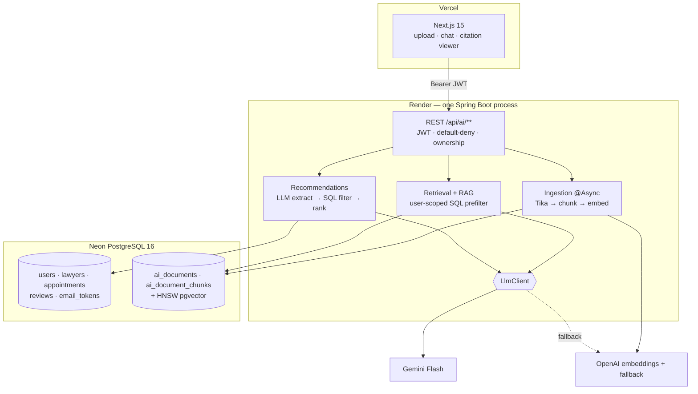

# VakilConnect AI Architecture & Roadmap

**Status:** design only. No code written, no files modified, no migrations, no
dependencies added.
**Method:** every claim about existing code was checked against the tree at
`821b9a7`+. File and line references are given so they can be re-checked.
Anything I could not verify is marked as such.

---

## 1. Executive Summary

VakilConnect is a working Spring Boot 3.5.15 / Java 21 / PostgreSQL 16
marketplace with 402 passing integration tests, a Flyway-owned schema (V1–V7),
JWT auth with credential-change invalidation, and a complete identity stack
(verification, password reset, email transport with retry and metrics).

**The single most important audit finding: there is no document domain at all.**
No `documents` table, no entity, no upload endpoint, no storage. Every AI
feature that involves "upload a contract" is greenfield. That is good news —
nothing has to be retrofitted — but it means the first real AI phase is
unglamorous plumbing, not a chatbot.

**The second finding shapes the recommendation engine:** `Lawyer` already
carries richly structured, queryable data — `specializations` (M:N),
`practiceCities` (M:N), `languages` (M:N), `rating`, `experienceYears`,
`consultationFee`, `verified`. Almost all of "recommend a lawyer" is a SQL
problem that is already half-solved. The LLM's job there is **understanding the
user's messy description**, not ranking rows.

**Recommendation:** Spring Boot + LangChain4j + pgvector in the existing Neon
database. One process, one datastore, no Python service, no separate vector DB.

---

## 2. Existing Architecture Audit

### 2.1 Verified stack

| Item | Value | Evidence |
|---|---|---|
| Spring Boot | 3.5.15 | `backend/pom.xml` parent |
| Java | 21 | `<java.version>` |
| Database | PostgreSQL 16 (Neon) | `AbstractIntegrationTest:46` uses `postgres:16-alpine` |
| Migrations | Flyway V1–V7, `ddl-auto: validate` | `application.yaml` |
| Build | Maven wrapper 3.9.11 | `.mvn/wrapper` |
| Tests | 402 passing, Testcontainers | reported by owner, 16+ IT classes |
| Frontend | Next.js 15.5.22, React 19, TanStack Query, Zustand | `frontend/package.json` |
| Deployment | Render (backend), Vercel (frontend), Neon (DB) | `DEPLOYMENT.md` |

### 2.2 Tables that actually exist

Extracted from the migrations, not assumed:

`users`, `lawyers`, `specializations`, `lawyer_specializations`,
`availabilities`, `appointments`, `reviews` (V1) · `countries`, `states`,
`cities`, `city_aliases`, `languages` (V3) · `lawyer_practice_cities`,
`lawyer_languages` (V4) · `email_tokens` (V7).

**Fifteen tables. None of them store documents or vectors.**

### 2.3 🔴 No document domain exists

```
find src/main/java -path "*document*" -type f   →  0 files
grep "CREATE TABLE documents"                   →  0 matches
git ls-files .../document .../notification      →  0 tracked files
```

Empty scaffolding directories exist for `document`, `notification`,
`specialization` and `availability` (the last two have their real code under
`lawyer/`). They are untracked and contain nothing. **Do not mistake them for
partial implementations.**

The stale `database/schema.sql` — already banner-marked "HISTORICAL DESIGN
ARTEFACT — DO NOT RUN" — contains a `documents` table that was never built. It
is not the schema.

### 2.4 Conventions the AI layer must follow

- **Feature packages**, not layer packages: `lawyer/{controller,service,repository,dto,entity}`. AI code belongs in `ai/…`, not scattered.
- **Entities never cross the HTTP boundary**; controllers speak DTOs. `open-in-view: false`.
- **Errors**: `ErrorResponse` with a nullable machine-readable `code`, `@JsonInclude(NON_NULL)`; typed exceptions mapped in `GlobalExceptionHandler`. AI failures must use this, not a new envelope.
- **Authorization is URL-pattern based** in `SecurityConfig` with `anyRequest().authenticated()` default-deny. Ownership checks live in service code.
- **Config**: `@ConfigurationProperties` records registered explicitly on `VakilconnectApplication` (`IdentityProperties`, `EmailProperties`). An `AiProperties` follows that precedent.
- **Async + retry already exist** — `AsyncConfig` provides `@EnableAsync`, `@EnableRetry` and a bounded `emailTaskExecutor` with a counting rejection handler. Ingestion can copy this pattern rather than invent one.
- **Metrics**: Micrometer + Prometheus on port 9091, dot-separated names (`vakilconnect.email.send`).

### 2.5 Data available for lawyer recommendation

`Lawyer` (`lawyer/entity/Lawyer.java`) exposes: `specializations` (M:N),
`practiceCities` (M:N), `languages` (M:N), `primaryCity`, `city`, `rating`,
`totalReviews`, `experienceYears`, `consultationFee`, `verified`, `bio`.
`LawyerRepository.search` already filters on most of these, and `availabilities`
+ `appointments` answer "can they see me Tuesday".

**This is the decisive fact for §3.D: the ranking inputs are already
structured.**

---

## 3. Recommended AI Features

Scored against: does it need an LLM, does the data exist, portfolio value.

| # | Feature | Verdict | Why |
|---|---|---|---|
| **1** | **Document Q&A with citations** (B) | ✅ Build | The core RAG showcase. Grounded, verifiable, demoable |
| **2** | **Document analysis** — summary, parties, dates, obligations, amounts (C) | ✅ Build | Structured LLM output; objectively checkable |
| **3** | **Clause & risk surfacing** (G) | ✅ Build | Highest perceived value; must be framed as *surfacing*, never advice |
| **4** | **Intake → structured case summary** (E) | ✅ Build | Where an LLM genuinely beats a form: turning prose into a typed object |
| **5** | **Lawyer recommendation** (D) | ✅ Build — **but mostly SQL** | See below |
| 6 | Document classification (F) | ✅ Build — fold into ingestion | One cheap classify call; drives chunking and prompts |
| 7 | Legal RAG over a knowledge corpus (A) | ⚠️ Defer | Needs a licensed, current Indian-law corpus. Sourcing is the hard part, not the code |
| 8 | Lawyer private knowledge base (H) | ⚠️ Defer | Tenant isolation is the same mechanism as user isolation; add after that is proven |
| 9 | Conversation memory (I) | ✅ Minimal only | Persist messages in Postgres. **Never embed conversations** |

### On D — do not use an LLM where SQL is better

The user's brief says this explicitly and the audit confirms it. Correct split:

1. **LLM (extraction only):** free text → `{specialization, city, language, budget, urgency}`. Structured output, one cheap call.
2. **SQL (deterministic):** filter `verified = true`, specialization, city, fee range, language — reusing `LawyerRepository`. This decides *who is eligible*.
3. **Ranking:** deterministic score over `rating`, `totalReviews`, `experienceYears`, availability.
4. **LLM (optional, ≤10 candidates):** one-sentence *explanation* per lawyer.

The LLM never decides eligibility, never sees the full lawyer table, and never
generates SQL. If the LLM is unavailable the feature degrades to today's search
— not an outage.

---

## 4. Recommended RAG Architecture

| | A: Boot + LangChain4j + pgvector | B: Boot + Python service | C: Hybrid | D: Boot + external vector DB |
|---|---|---|---|---|
| Complexity | **Low** — one process | High — 2 services, 2 deploys | Medium-high | Medium |
| Latency | **Best** — no hop | +network hop | +hop when crossed | +network per query |
| Cost | **Lowest** — no extra service | Second Render service | Second service | Vector DB bill |
| Deployment | **Unchanged** | New pipeline, CORS, auth between services | New pipeline | New vendor |
| Testing | **Testcontainers, as today** | Cross-language integration | Mixed | Mock/live vendor |
| Security | **One trust boundary** | New internal boundary to secure | New boundary | Data leaves your DB |
| Your skills | **Java — your strength** | Python — a second thing to maintain | Split focus | Java |
| Portfolio | **High** — RAG in Java is rarer and more impressive | Common | Muddled | Common |

### ✅ Recommendation: **Option A**

One Spring Boot process, LangChain4j, pgvector inside the existing Neon
database. Rationale:

- **You are a Java developer.** A Python service you maintain badly is worth less than a Java one you maintain well.
- **A separate service buys nothing here.** Its usual justification is Python-only libraries; LangChain4j covers loaders, splitters, embedding stores, chat memory and structured output.
- **pgvector keeps documents and vectors in one database** — one backup, one transaction, one `user_id` foreign key enforcing isolation. With a separate vector DB, isolation becomes a metadata filter you must never get wrong.
- **"Production RAG in Spring Boot with pgvector"** is a more distinctive portfolio line than "I called OpenAI from Python."

**Revisit only if** you need a reranker model with no Java binding, or GPU-local
inference. Neither applies to a portfolio project.

---

## 5. LangChain4j Decision

**Use it, selectively.** Take `dev.langchain4j:langchain4j` plus the OpenAI and
pgvector modules for: document loaders/parsers, splitters, `EmbeddingStore`,
`ChatMemory`, and `AiServices` for typed structured output.

**Do not** use its high-level "chain" abstractions for the retrieval pipeline.
Write retrieval explicitly — filter, search, assemble context, call, parse.
Retrieval is where quality lives; a framework hiding it makes debugging poor
answers guesswork, and explicit code demonstrates understanding.

---

## 6. LLM Decision

| Provider | Cost | Structured output | Legal-RAG fit |
|---|---|---|---|
| **Gemini Flash** | Cheapest, generous free tier | Native JSON schema | ✅ **Primary** |
| **OpenAI GPT-4o-mini** | Very cheap | Strict JSON schema, best-in-class tooling | ✅ **Fallback / extraction** |
| Anthropic Claude | Higher | Good | Best long-context, but cost |
| Open-source self-hosted | GPU cost ≫ API at this volume | Weak | ❌ |

**Primary: Gemini 2.x Flash. Fallback: GPT-4o-mini.** Behind one
`LlmClient` interface — the Phase 3 `EmailService` pattern, where
`ResendEmailSender` is the only class that knows the vendor. Swapping providers
becomes one class plus a property.

**Different models for different jobs:**

| Job | Model | Why |
|---|---|---|
| Grounded answering | Gemini Flash | Quality matters, volume is low |
| Classification, extraction | Cheapest available | Short output, schema-constrained |
| Reranking | **None initially** | Postpone — see §10 |
| Embeddings | dedicated model, never a chat model | §7 |

---

## 7. Embedding Decision

**`text-embedding-3-small` (OpenAI), 1536 dimensions, cosine distance.**

- ~$0.02 per million tokens — a 50-page contract costs a fraction of a cent.
- 1536 dims × 4 bytes = 6 KB/vector; 10,000 chunks ≈ 60 MB. Comfortable on Neon.
- Cosine is the standard for normalised text embeddings and is what `vector_cosine_ops` indexes.

**Record the model name on every row.** Embeddings from different models are not
comparable; without `embedding_model` on the chunk table, a model upgrade
silently corrupts retrieval. This is the single most common RAG data-model
mistake.

---

## 8. Vector Database Decision

**pgvector, in the existing Neon database.**

| | pgvector | Qdrant | Pinecone | Weaviate | Chroma |
|---|---|---|---|---|---|
| New infrastructure | **None** | Service | SaaS bill | Service | Not production |
| Isolation | **FK + SQL** | Metadata filter | Metadata filter | Metadata filter | — |
| Transactional with app data | **Yes** | No | No | No | No |
| Scale ceiling | ~10⁶ vectors | Higher | Higher | Higher | Low |

At portfolio scale you will have thousands of vectors, not millions. pgvector's
ceiling is irrelevant; its transactional integrity and single-backup story are
decisive. **Neon supports pgvector via `CREATE EXTENSION vector` — confirm it is
enabled on your instance before Phase 1; I could not verify your Neon plan from
the repository.**

Index: **HNSW** (`vector_cosine_ops`), better recall/latency than IVFFlat and no
training step.

⚠️ **Constraint from the existing setup:** `ddl-auto: validate` means Hibernate
must be able to validate whatever column type you choose. The `vector` type has
no native Hibernate mapping. Options, in order of preference: (a) do not map the
embedding column on the entity at all and write/read it via `JdbcTemplate` —
`validate` ignores unmapped columns, which the codebase already relies on for
`email_tokens`' audit columns; (b) add the `pgvector-java` Hibernate type.
**Option (a) needs no dependency and is consistent with existing practice.**

---

## 9. Document Processing Architecture

```
upload → validate (type, size, magic bytes)
       → store bytes
       → extract text (Tika)
       → normalise
       → classify (one cheap LLM call)
       → chunk
       → embed (batched)
       → persist chunks + vectors
```

**Libraries — only two additions justified:**

| Library | Justification |
|---|---|
| **Apache Tika** | One API for PDF, DOCX, TXT, RTF. Brings PDFBox and POI transitively — adding them separately would be redundant |
| **LangChain4j** | Splitters, `EmbeddingStore`, `AiServices` |

**No OCR initially.** Tesseract is a native binary, a large Docker layer, and
slow. Scanned documents are a real gap — handle it by **detecting** low
extracted-text density and telling the user "this looks like a scan, we cannot
read it yet" rather than silently returning nothing. Add OCR only if users
actually hit it.

**Storage.** Render's filesystem is ephemeral — files vanish on redeploy. Options:
(a) `bytea` in Postgres, simplest, fine at this scale; (b) S3/R2, correct at
scale, adds a vendor and credentials. **Recommend (a) initially**, with a size
cap, and document the migration path.

---

## 10. RAG Retrieval Strategy

Ship the smallest thing that is genuinely grounded, then improve on measurement.

**Phase 1 retrieval (build this):**
- Chunk ~1000 tokens, 15% overlap, split on paragraph boundaries.
- **Metadata pre-filter is mandatory and non-negotiable:** `WHERE user_id = ? AND document_id = ?` in SQL, *before* similarity. Isolation is a database predicate, never a prompt instruction.
- Top-k = 5 by cosine distance.
- Assemble context with explicit chunk IDs; require the model to cite them.
- Store the returned citations so the UI can highlight the source.

**Add only when measured (§13 first):**
- **Hybrid search** — pgvector + Postgres full-text. Highest expected gain, because legal queries contain exact terms ("Section 138", "Clause 7.2") that embeddings blur. `pg_trgm` is already installed (V3).
- **Query rewriting** — cheap, helps conversational follow-ups.
- **Parent-child retrieval** — retrieve small, send the enclosing section.

**Explicitly do not build initially:** cross-encoder reranking (no good Java
option, adds latency and cost), contextual compression, multi-query fan-out.
These are the things people add because they sound sophisticated, before they
can tell whether retrieval was the problem.

---

## 11. AI Database Design

Five tables. Not the nine the brief listed.

### `ai_documents`
Purpose: an uploaded file and its processing state.
Key columns: `id`, `user_id` FK→`users` **ON DELETE CASCADE**, `filename`,
`content_type`, `size_bytes`, `sha256`, `status` (`PENDING`/`PROCESSING`/`READY`/`FAILED`),
`failure_reason`, `doc_type` (classification), `page_count`, `content` (`bytea`),
`created_at timestamptz`.
Indexes: `(user_id, created_at DESC)`; unique `(user_id, sha256)` to make
re-upload idempotent.
**Security: `user_id` is the isolation boundary. Every query filters on it.**

### `ai_document_chunks`
Purpose: a text span plus its vector.
Key columns: `id`, `document_id` FK **CASCADE**, `user_id` (**denormalised
deliberately** so the isolation predicate never needs a join), `chunk_index`,
`content text`, `token_count`, `page_from`, `page_to`, `embedding vector(1536)`,
`embedding_model`, `created_at`.
Indexes: HNSW on `embedding` `vector_cosine_ops`; `(document_id, chunk_index)`;
`(user_id)`.
**No separate `document_embeddings` table** — a 1:1 split doubles the joins on
the hottest path for no benefit.

### `ai_conversations`
`id`, `user_id` FK CASCADE, `document_id` FK **NULL** (null = general chat),
`title`, `created_at`, `last_message_at`. Index `(user_id, last_message_at DESC)`.

### `ai_messages`
`id`, `conversation_id` FK CASCADE, `role` (`USER`/`ASSISTANT`), `content`,
`token_count`, `created_at`. Index `(conversation_id, created_at)`.
**Never embedded.** Conversations are transcripts, not a knowledge base.

### `ai_citations`
`id`, `message_id` FK CASCADE, `chunk_id` FK→`ai_document_chunks`, `rank`.
This is what makes citations *verifiable* rather than model-asserted — the UI
can render the actual chunk text.

**Deliberately omitted:** `ai_usage` (Micrometer counters already exist — use
them), `ai_feedback` (add when there are users to give feedback).

**Migration:** one new Flyway migration, **V8**, additive only. Plus
`CREATE EXTENSION IF NOT EXISTS vector`.

---

## 12. API Design

All under `/api/ai/**`, all `authenticated()` by default-deny — **no new
`permitAll` matchers**. Ownership is enforced in the service by `user_id`, never
by a path variable alone.

| Method | Path | Role | Notes |
|---|---|---|---|
| POST | `/api/ai/documents` | CLIENT, LAWYER | Multipart. 413 oversize, 415 wrong type. Returns `202` + id; ingestion is async |
| GET | `/api/ai/documents` | owner | Paged, existing `Paged<T>` envelope |
| GET | `/api/ai/documents/{id}` | owner | **404 for another user's id, not 403** — matches the existing convention of not disclosing existence |
| DELETE | `/api/ai/documents/{id}` | owner | Cascades chunks |
| POST | `/api/ai/documents/{id}/ask` | owner | `{question}` → answer + citations |
| GET | `/api/ai/documents/{id}/analysis` | owner | Cached structured analysis |
| POST | `/api/ai/intake` | CLIENT | Free text → structured case summary |
| POST | `/api/ai/recommendations` | CLIENT | Case summary → ranked lawyers |
| GET/POST | `/api/ai/conversations…` | owner | Transcript CRUD |

**Streaming: not initially.** SSE complicates the Axios client, error handling
and testing. Answers over 5 chunks take ~2–4s; a spinner is acceptable. Add SSE
once the pipeline is stable.

**Rate limiting:** the audit already flagged the *absence* of rate limiting as a
production blocker. AI endpoints make it urgent — each call costs real money.
Per-user daily quotas enforced in the service, plus the Bucket4j filter from the
production-readiness plan.

---

## 13. Security & Legal Safety

### Threat model

| Threat | Control |
|---|---|
| **Cross-user retrieval** | `user_id` predicate **in SQL before similarity search**. Never a prompt instruction. A test must assert user A cannot retrieve B's chunk |
| **Prompt injection via document** | A contract can contain "ignore previous instructions". Mitigate: retrieved text is wrapped in explicit delimiters and labelled untrusted; system prompt states document content is *data, never instructions*; no tool-calling in the RAG path |
| **IDOR** | Ownership checked in service; 404 not 403 |
| **Malicious/oversize files** | Magic-byte check, hard size cap, page cap, Tika parse timeout |
| **API key exposure** | Env var, fail-fast like `JWT_SECRET`/`TOKEN_PEPPER`. Never logged, redacting `toString()` on the properties record — the pattern `EmailProperties` already uses |
| **Token abuse** | Per-user daily quota + max document size + max documents |
| **PII in logs** | Never log document text, chunk content, questions or answers. Log ids and token counts only |
| **LLM making authz decisions** | **Structurally prohibited.** The LLM never sees a role, never returns a permission, and its output never routes a request |

### Legal-safety policy

1. **Never invent citations.** Every claim maps to a stored `chunk_id` the UI can display.
2. **Insufficient evidence → say so.** "The document does not address termination" is a correct, valuable answer.
3. **Separate retrieved fact from interpretation.** Distinct response fields, distinct UI treatment.
4. **Ask for jurisdiction** before anything jurisdiction-dependent. Indian law varies by state.
5. **Never present output as legal advice.** Persistent UI disclaimer, and the system prompt forbids advice framing — the product recommends *lawyers*, it does not replace them.
6. **Risk flags are "clauses worth reviewing with a lawyer,"** never "this contract is unsafe."

---

## 14. Cost Strategy

**Target: under $5/month in development.**

| Item | Estimate |
|---|---|
| Embeddings | 50-page doc ≈ 25k tokens ≈ **$0.0005**. 100 docs ≈ $0.05 |
| Q&A (Gemini Flash) | ~4k in / 500 out ≈ **$0.0005/question**. 1,000 questions ≈ $0.50 |
| Document analysis | ~$0.002 each, **cached permanently** |
| Classification | ~$0.0001 |
| Vector storage | **$0** — existing Neon |
| **Total dev** | **$1–5/month** |

Controls: use free tiers first; **cache analysis and classification permanently**
(a document does not change); dedupe by `sha256` so re-upload costs nothing;
cap document size (10 MB) and count (20/user); daily question quota (50/user);
batch embedding calls; never re-embed unchanged content.

---

## 15. Evaluation Strategy

Without this, "improving RAG" is guesswork — and having it is itself a portfolio
differentiator.

**Dataset:** 30–50 questions over 5–10 real documents (rental agreement,
employment contract, NDA, legal notice, sale deed). For each: question, expected
source chunk ids, expected answer characteristics.

**Must include adversarial and refusal cases:**
- Not in the document → must say so, not confabulate.
- Prompt injection inside the document → must ignore it.
- Cross-user question → must retrieve nothing.
- Jurisdiction-dependent → must ask.

**Metrics:** retrieval recall@5 and precision@5 (measurable against expected
chunk ids); citation accuracy (do cited chunks support the claim); groundedness;
refusal rate on unanswerable questions; p95 latency; tokens and cost per query.

Run as a JUnit suite against a fixed corpus, with LLM calls **recorded and
replayed** so it is deterministic and free — the same discipline as
`MockRestServiceServer` in the Phase 3 email tests.

---

## 16. Implementation Roadmap

| Phase | Objective | Complexity | Migration |
|---|---|---|---|
| **AI-0** | Foundation: `AiProperties`, `LlmClient` interface + Gemini adapter + console/stub adapter, fail-fast key validation, Micrometer counters | **S** | No |
| **AI-1** | Document domain: V8 (`ai_documents`, `pgvector` extension), upload/list/get/delete, validation, `bytea` storage. **No AI yet** | **M** | **V8** |
| **AI-2** | Ingestion: Tika extraction, chunking, embedding, `ai_document_chunks`, async via the existing `AsyncConfig` pattern, status machine | **L** | in V8 |
| **AI-3** | Retrieval + Q&A: user-scoped vector search, grounded prompt, citations, `ai_conversations`/`ai_messages`/`ai_citations` | **L** | V9 |
| **AI-4** | Structured analysis: summary, parties, dates, obligations, amounts, clause/risk surfacing. Cached | **M** | No |
| **AI-5** | Intake + recommendations: LLM extraction → deterministic SQL → deterministic ranking → optional explanations | **M** | No |
| **AI-6** | Evaluation harness + safety hardening: eval dataset, recorded fixtures, injection tests, cross-user isolation tests, quotas | **M** | No |
| **AI-7** | Frontend: upload UI, document viewer with citation highlighting, chat, analysis panel | **L** | No |

**AI-1 and AI-2 are the unglamorous half and the reason most portfolio RAG
projects are shallow.** Do them properly.

### Files per phase (indicative)

- **AI-0** — create `ai/config/AiProperties`, `ai/llm/{LlmClient,GeminiLlmClient,StubLlmClient}`, `ai/metrics/AiMetrics`; modify `VakilconnectApplication` (register properties), `pom.xml`, `application.yaml`, `.env.example`.
- **AI-1** — create `ai/document/{entity,repository,service,controller,dto}`, `db/migration/V8__ai_documents.sql`; modify `SecurityConfig` only if a matcher is genuinely needed (default-deny may already suffice).
- **AI-2** — create `ai/ingest/{TextExtractor,DocumentChunker,EmbeddingService,IngestionPipeline,IngestionJob}`; modify `AsyncConfig` (a second bounded executor).
- **AI-3** — create `ai/rag/{RetrievalService,PromptBuilder,RagService,CitationMapper}`, `ai/chat/**`, `V9__ai_conversations.sql`.
- **AI-4/5/6/7** as above.

---

---

## 16a. AI-0 — DELIVERED (implementation record)

Status: **implemented, not committed, test suite not yet executed.** This
section records what actually shipped and, more usefully, where it departs from
the design above. The design is the plan; this is the fact.

> **THE PROVIDER DECISION CHANGED AFTER §6 WAS WRITTEN.** Sections 6, 14 and the
> Final Answers below still describe Gemini Flash with an OpenAI fallback. That
> is superseded. The binding requirement is now that the AI layer must be fully
> usable for a resume/demo project with **zero paid API usage**, so the real
> provider is **local inference via Ollama** and there is **no API key anywhere
> in the codebase**. §6's reasoning about cost per token is no longer the
> deciding factor; it is retained because it is the argument to revisit if a
> hosted model is ever wanted for a deployed demo.

### What exists

Ten classes in a single flat package `com.arshraj.vakilconnect.ai`:

`AiProperties` · `LlmClient` · `LlmRequest` · `LlmResponse` · `LlmException` ·
`PermanentLlmException` · `AiMetrics` · `AiConfig` · `OllamaLlmClient` ·
`StubLlmClient`

```
caller → LlmClient → StubLlmClient    (provider=stub,   default everywhere incl. production)
                   → OllamaLlmClient  (provider=ollama, local development and demo)
```

Provider selection by `@ConditionalOnProperty` on `vakilconnect.ai.provider`.
Five test classes, 56 tests. **Zero dependencies added** — `pom.xml` untouched.

### Deviations from the design above — read these

**1. Ollama, not Gemini, and no paid provider at all.** No API key, no billing
account, no credential of any kind. `AiProperties` has no credential component,
and a reflection test fails the build if one reappears without a redacting
`toString()`.

**2. No LangChain4j, and no new dependencies.** §5 says "use it, selectively" —
still right for AI-2, where the loaders, splitters and `EmbeddingStore` do real
work. Wrong for AI-0: `/api/chat` is one POST, and `RestClient` plus Jackson
already ship with `spring-boot-starter-web`. `ResendEmailSender` set the
no-vendor-SDK precedent explicitly.

**3. Flat `ai/` package, not `ai/config`, `ai/llm`, `ai/metrics`.** Ten files do
not need three packages; the existing `email/` package is the precedent.
Sub-packages arrive at AI-1 (`ai/document`) and AI-2 (`ai/ingest`).

**4. Production runs the stub and requires NO Render variables.** Ollama is a
local inference server — running it on Render would mean a multi-gigabyte model
image doing CPU inference on a small web instance, which is a separate hosting
decision that has not been made. Production stays on the stub until it is. At
AI-0 that costs nothing, because no caller exists.

**5. No retry policy.** The transient/permanent exception split exists so a
policy can be added at the call site. Whether to retry depends on the caller: a
background job should back off, a user waiting on a response is better served by
a fast failure.

### Decisions worth carrying into later phases

- **`stream: false` is mandatory on every Ollama request, and `done` is
  verified on every response.** Ollama streams NDJSON by default, and Jackson
  does **not** fail on trailing tokens — so a regression here would parse the
  first chunk and return a **one-token answer as a successful response**. Silent
  truncation, invisible to status codes, exceptions and metrics. The `done=false`
  guard is what makes it loud.
- **Error response bodies are never read into exceptions.** They echo the
  request, and the request is user content. The 404 handler names the model from
  *our own configuration* instead, and tells the developer to run `ollama pull`.
- **`LlmRequest` and `LlmResponse` override `toString()`.** Records print every
  component, and prompts and completions are user content. Any record added in
  AI-1+ that touches either must do the same.
- **No startup health check against Ollama.** It is a tool developers start and
  stop freely, and CI has none. The cost is that "Ollama is not running"
  surfaces on the first request, which is why that message names the URL and the
  command.
- **Timeouts live in `AiConfig`, not the adapter.** Setting a request factory in
  the adapter's constructor would overwrite the one `MockRestServiceServer`
  installs, and the unit tests would hit a real server if one happened to be up.
- **`read-timeout` is 120s.** Local CPU inference is slow, and the first call
  also loads the model into RAM. A cloud-tuned 30s value would fail healthy calls.

### Configuration surface

`AI_PROVIDER` [stub] · `OLLAMA_BASE_URL` [http://localhost:11434] ·
`AI_MODEL` [llama3.2] · `AI_TEMPERATURE` [0.2] · `AI_MAX_OUTPUT_TOKENS` [1024] ·
`AI_CONNECT_TIMEOUT` [PT5S] · `AI_READ_TIMEOUT` [PT120S]

**Nothing needs to be set on Render.** Locally, `AI_PROVIDER=ollama` is the only
variable required to go live.

### Running it locally

```
brew install ollama          # or https://ollama.com/download
ollama serve
ollama pull llama3.2
export AI_PROVIDER=ollama
curl http://localhost:11434/api/tags     # confirm the server is up
```

Recommended model: **`llama3.2`** (3B, ~2GB) — runs on 8GB RAM with no GPU.
`llama3.1:8b` (~5GB) gives noticeably better answers if the machine allows.
Verify tags with `ollama list`; they change over time, which is why the model is
a property.

### Open items before AI-1

- Run `./mvnw clean test` and confirm the count.
- Confirm **pgvector availability on the Neon plan** — still unverified, and it
  is the assumption AI-1's V8 migration rests on. If unavailable, Qdrant is the
  fallback and user isolation stops being a foreign key.
- Decide whether `ddl-auto: validate` tolerates the `vector` type, or whether
  the embedding column stays unmapped and is written through `JdbcTemplate` (as
  `email_tokens`' audit columns already are).
- **Embeddings must also be free.** §7 recommends OpenAI `text-embedding-3-small`,
  which is now inconsistent with the zero-cost requirement. Ollama serves
  embeddings too (`nomic-embed-text`, 768 dimensions, via `/api/embeddings`), and
  the dimension change affects the V8 column definition — so this must be settled
  **before** the migration is written, not after.

---

## 17. Features NOT Recommended

| Not building | Why |
|---|---|
| **Generic chatbot** | No grounding, no citations, indistinguishable from ChatGPT. Actively harmful in a legal product |
| **Autonomous legal agent** | Multi-step autonomy with no verification, in a domain where wrong answers hurt people |
| **Web-search legal agent** | Unverifiable sources; Indian legal content online is often outdated or wrong |
| **LLM-generated SQL** | Injection surface *and* a correctness problem. `LawyerRepository` already does this correctly |
| **LLM in authorization** | Non-deterministic security is not security |
| **Fine-tuning** | RAG is not yet built, let alone measured. Fine-tuning teaches style, not facts — it would not fix grounding. Revisit only with eval data proving RAG is insufficient |
| **Microservices** | One deployable, one database. Splitting adds ops burden and buys nothing at this scale |
| **Conversation embedding** | Bloats the index with low-value text and risks leaking one user's phrasing into another's retrieval |
| **OCR (initially)** | Native binary, large image, slow. Detect-and-inform first |

---

## 18. Risks and Trade-offs

| Risk | Mitigation |
|---|---|
| **pgvector on Neon unconfirmed** | Verify `CREATE EXTENSION vector` before AI-1. If unavailable, Qdrant is the fallback and isolation becomes a metadata filter you must test hard |
| **`bytea` storage does not scale** | Accepted at portfolio scale; size caps; documented S3 path |
| **`ddl-auto: validate` vs `vector` type** | Leave the column unmapped, access via `JdbcTemplate` — same technique the codebase already uses for unmapped `email_tokens` columns |
| **LLM provider outage** | `LlmClient` interface + fallback provider; AI features degrade, core marketplace unaffected |
| **Legal liability** | Never advice framing; citations always; jurisdiction prompts; persistent disclaimer |
| **Scope explosion** | Roadmap is ordered so AI-3 is a complete, demoable product. AI-4+ are increments |

---

## 19. Final Architecture



---

# Final Answers

### A. Top 5 AI features
1. **Document Q&A with verifiable citations** — the core showcase
2. **Structured document analysis** — summary, parties, dates, obligations, amounts
3. **Clause & risk surfacing** — highest perceived value
4. **Intake → structured case summary** — where an LLM genuinely beats a form
5. **Lawyer recommendation** — LLM extracts intent, **SQL decides**

### B. Recommended stack
Spring Boot 3.5.15 · Java 21 · LangChain4j · pgvector on existing Neon ·
Gemini Flash (generation) · OpenAI `text-embedding-3-small` (1536, cosine) ·
Apache Tika · Next.js 15 frontend

### C. Recommended architecture
**Option A** — one Spring Boot process, one PostgreSQL. No Python service, no
separate vector database, no microservices.

### D. First phase
**AI-0 — Foundation.** `AiProperties`, `LlmClient` with a Gemini adapter and a
stub adapter, fail-fast key validation, metrics. Small, no migration, no
schema risk, and it establishes the seam that makes every later phase testable
without spending money.

### E. Exact dependencies

```
dev.langchain4j:langchain4j
dev.langchain4j:langchain4j-open-ai          (embeddings)
dev.langchain4j:langchain4j-google-ai-gemini (generation)
dev.langchain4j:langchain4j-pgvector         (embedding store)
org.apache.tika:tika-core
org.apache.tika:tika-parsers-standard-package
```

Six additions. No OCR, no separate HTTP client (`RestClient` ships with the
web starter), no vector-DB driver, no PDFBox/POI (transitive via Tika).

### F. Expected cost
**Development: $1–5/month.** Light production (100 users, 500 docs, 5k
questions/month): **$5–15/month.** Embeddings are negligible; generation
dominates; analysis caching removes most repeat cost.

### G. What makes this stand out

Most "AI projects" are a chat box calling an API. This is different in ways an
interviewer can probe:

- **RAG in Java/Spring Boot** — rarer and harder than the Python default.
- **Verifiable citations backed by a real `ai_citations` table** — not model-asserted.
- **Measured quality** — a real eval dataset with recall, groundedness and refusal metrics. Almost nobody does this.
- **Correct restraint** — using SQL for ranking and an LLM only for intent extraction demonstrates better judgement than using an LLM for everything.
- **Security done properly** — user isolation as a SQL predicate, documents treated as untrusted input, prompt-injection tests, and an LLM that is structurally incapable of making authorization decisions.
- **It sits on a genuinely production-grade base** — 402 tests, Flyway, JWT credential invalidation, a production-readiness audit. The AI layer is credible *because* the foundation is.

The strongest sentence you will be able to say: *"I can show you the exact
document chunk behind every sentence the assistant produced, and I can measure
how often it gets it right."*
