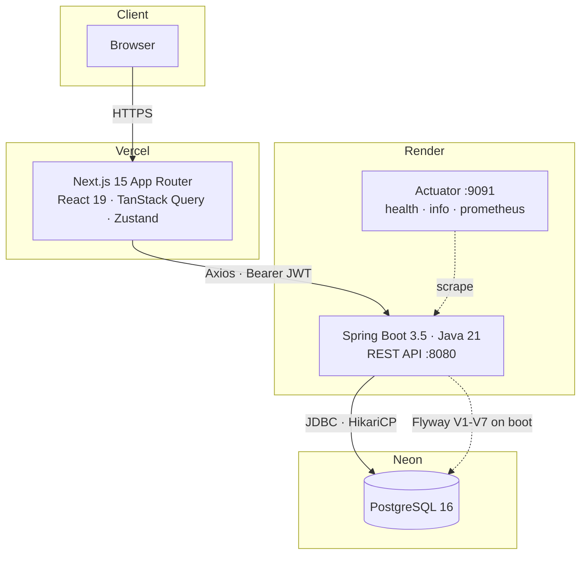
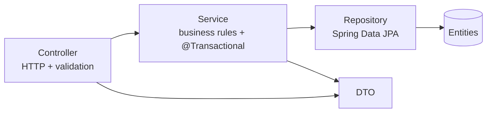
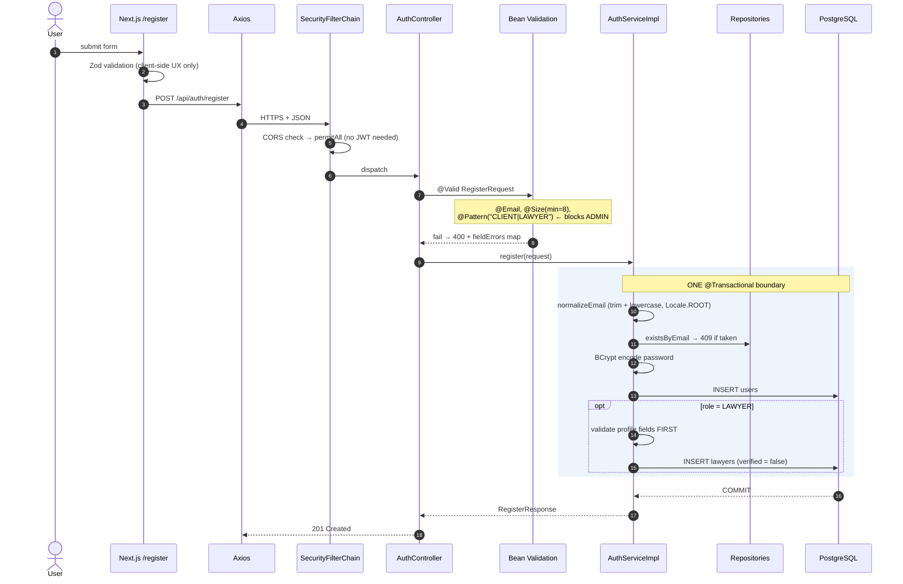
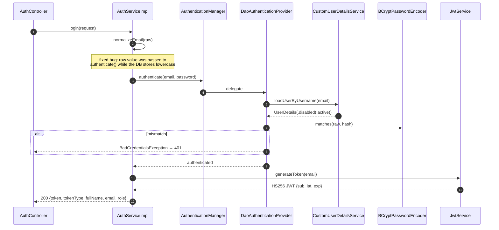
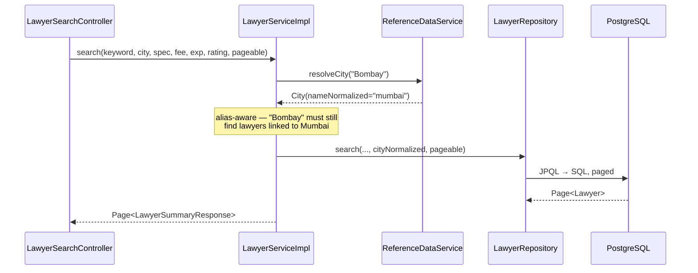
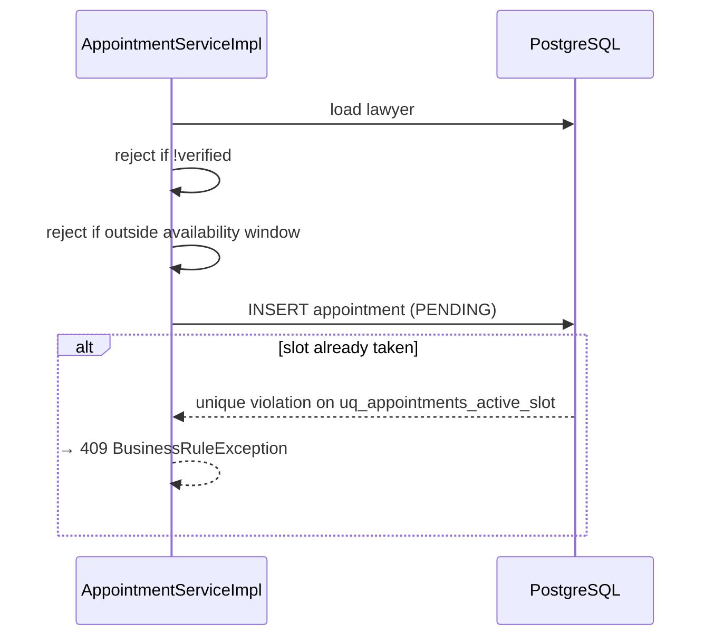
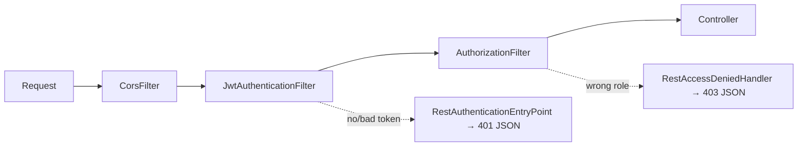

# VakilConnect — Interview Study Guide

Everything here is read out of the codebase. Where a claim has a file and line,
it is given, so you can open the file mid-interview and be right.

---

## 0. The pitch, and what actually impresses

**The product:** a marketplace connecting clients with verified lawyers in
India. Clients search by city, specialization, fee and experience; lawyers
publish availability; clients book appointments; admins verify lawyers before
they are publicly listed; clients review completed appointments.

**What gets you hired is not that list.** Every candidate has a CRUD app. What
almost none of them have:

| Story | Why it lands |
|---|---|
| **Zero-downtime schema migration** (free-text city → normalised reference model) with dual-write, backfill, metric-gated cut-over and rollback | This is the single hardest thing in production engineering. Most candidates have never done it |
| **Double-booking prevented by a partial unique index**, not `synchronized` or a transaction | Shows you know where correctness belongs — the database, not the JVM |
| **Root-caused `function min(uuid) does not exist`** from surefire XML, not the pasted log | Debugging discipline: the visible exception was not the root cause |
| **Wrote a 36-finding production audit against your own code** | Self-criticism is the rarest signal in a junior/mid candidate |
| **242 integration tests on real PostgreSQL** via Testcontainers, not H2 | You know why H2 lies |

Rehearse those five. They are your differentiators.

---

## 1. Architecture



**Why this shape.** Three managed services, zero servers to patch. The frontend
and backend are separate origins on purpose — the API is consumable by a future
mobile client, and the browser is not a trusted layer.

### Backend layering



**The rule that matters:** entities never cross the HTTP boundary. Controllers
speak DTOs. This is why a lazy association can never trigger a
`LazyInitializationException` during serialisation — combined with
`open-in-view: false` (`application.yaml`), which is a deliberate choice most
candidates leave at Spring's unsafe default.

> **Interview trap:** "Why `open-in-view: false`?" — Because the default keeps a
> database connection open for the entire request including view rendering, so
> a slow template holds a Hikari connection. It also hides N+1 problems by
> silently resolving lazy proxies outside the service layer. Turning it off
> makes those explode loudly in tests instead of quietly in production.

---

## 2. Package map

Organised **by feature, not by layer** — `lawyer/` contains its own controller,
service, repository, dto, entity. Not `controllers/`, `services/`, `entities/`.

| Package | Purpose | Interview angle |
|---|---|---|
| `auth/` | Register, login, JWT issuance | "Walk me through login" |
| `security/jwt/` | `JwtService`, `JwtAuthenticationFilter`, `CustomUserDetailsService` | The most-probed package |
| `security/handler/` | `RestAuthenticationEntryPoint` (401), `RestAccessDeniedHandler` (403) | "How do you return JSON instead of an HTML error page?" |
| `user/` | `User` entity, roles, `/api/users/me` | Identity model |
| `lawyer/` | Profile, search, availability, appointments-as-lawyer | Biggest package; the search query lives here |
| `client/` | Client profile, booking, reviews | |
| `admin/` | Verification, user management, analytics | Role-based authz demo |
| `appointment/` | Appointment entity + lifecycle state machine | Concurrency story |
| `review/` | Review after completed appointment | Business-rule enforcement |
| `reference/` | Countries, states, cities, languages + **the migration machinery** | Your best story |
| `common/` | `BaseEntity`, typed exceptions, `GlobalExceptionHandler` | Cross-cutting |
| `config/` | Security, CORS, caching, OpenAPI, admin bootstrap | |
| `identity/` | V7 config for postponed email verification | Say "designed, deliberately postponed" |

**Why feature packages:** a change to lawyer search touches one directory. With
layer packages it touches four. It also makes extraction into a service
possible later without archaeology.

---

## 3. Request lifecycles

### 3.1 Registration



**Three things to point out unprompted:**

1. **No JWT is issued on registration.** The user must log in. Deliberate — it
   keeps token issuance in exactly one place.
2. **The lawyer profile is validated before anything is written**, so a bad
   request never leaves a half-created account. Both inserts are in one
   transaction (`AuthServiceImpl:25`).
3. **`ADMIN` is blocked at the DTO**, not the service —
   `@Pattern(regexp = "CLIENT|LAWYER")` on `RegisterRequest`. Rejected at 400
   before business code runs, with a passing test asserting it.

### 3.2 Login



**The bug you fixed here is a great answer to "tell me about a bug you found."**
`User.setEmail()` lowercases on write, so the DB only holds lowercase.
`login()` passed the **raw** request value to `authenticate()` but the
normalised value to `findByEmail`. So `Foo@Bar.com` failed authentication with a
correct password — and the normalised lookup was never reached, which is why the
bug was invisible when reading the method top-to-bottom.

### 3.3 Lawyer search — your performance + migration story



The predicate (`LawyerRepository:242`):

```sql
WHERE l.verified = true              -- admin approval gate
AND (:keyword IS NULL OR LOWER(fullName) LIKE %kw% OR LOWER(bio) LIKE %kw%)
AND (:specialization IS NULL OR LOWER(s.name) = :specialization)
AND (:city IS NULL
     OR EXISTS (reference model: practiceCities match)     -- NEW path
     OR (l.practiceCities IS EMPTY AND LOWER(l.city) = :city))  -- LEGACY fallback
AND fee/experience/rating range filters
```

**That two-branch city predicate is the migration cut-over.** Explain it like
this: rows migrated to the reference model are answered by the reference branch;
rows not yet migrated fall back to the legacy free-text column. The gate is
`practiceCities IS EMPTY` — *not* `primaryCity IS NULL` — because the gate and
the predicate must read the same collection. Gating on the primary would make a
lawyer with practice cities but no primary vanish from every city search,
silently, forever.

### 3.4 Appointment booking — your concurrency story



```sql
CREATE UNIQUE INDEX uq_appointments_active_slot
    ON appointments (lawyer_id, appointment_date, appointment_time)
    WHERE status IN ('PENDING', 'ACCEPTED');
```

**Why a partial index and not a `SELECT ... then INSERT` check:** a read-then-write
check has a race window between the read and the write. Two concurrent requests
both see the slot free and both insert. The index makes the *second* insert fail
atomically inside the database, where the check and the write are the same
operation. Partial, so a rejected/cancelled/completed appointment frees the slot
for rebooking.

**Say this line:** *"Correctness that can be expressed as a constraint belongs
in the database, not in application code — application code can be bypassed by
the next caller."*

### 3.5 Admin approval & reviews

- `PUT /api/admin/lawyers/{id}/verify` → `LawyerServiceImpl:238` is the **only**
  `setVerified(true)` in the codebase. No auto-verification exists. That's why
  the production Find-Lawyers page was empty: lawyers registered, nobody
  approved them, and the search gates on `verified = true`.
- Review requires a **completed** appointment, one review per appointment
  (unique on `appointment_id`), enforced server-side.

---

## 4. Database

### Tables (Flyway-owned, V1–V7)

| Table | Notes |
|---|---|
| `users` | Identity. `role`, `active` (admin), `is_email_verified`, `credentials_changed_at` (V7) |
| `lawyers` | 1:1 with a LAWYER user. `verified` (admin gate), fee, experience, bio, `bar_council_number` UNIQUE |
| `lawyer_specializations` | M:N join |
| `availabilities` | Weekly slots per lawyer |
| `appointments` | Lifecycle: PENDING → ACCEPTED/REJECTED → COMPLETED/CANCELLED |
| `reviews` | 1:1 with a completed appointment |
| `countries` / `states` / `cities` / `city_aliases` / `languages` | Reference data (V3) |
| `lawyer_practice_cities` / `lawyer_languages` | M:N reference links (V4) |
| `email_tokens` | V7, for postponed email verification |

### Migrations — the narrative

| Version | What | The lesson |
|---|---|---|
| V1 | Baseline mirroring the entity model exactly | `ddl-auto: validate` passes with zero diff |
| V2 | Partial unique index for double-booking | Correctness in the DB |
| V3 | Reference tables + `pg_trgm` GIN indexes | Fuzzy city matching |
| V4 | Link tables. **Every new column NULLABLE** | *"Adding NOT NULL to a populated table fails outright — nullable first, backfill second, tighten third."* This project hit that error once and wrote the rule into the migration header |
| V5 | Seed specializations | `ON CONFLICT DO NOTHING` = idempotent |
| V6 | Backfill reference links | Only links **unambiguous** matches — under-link rather than mis-link |
| V7 | Email-verification schema (postponed) | Additive-only so the previous jar still runs |

**Why Flyway over `ddl-auto: update`:** `update` never drops or alters
destructively, silently diverges between environments, and gives you no history.
Flyway gives versioned, checksummed, ordered migrations, and `validate` makes a
schema/entity mismatch a **startup failure** rather than a runtime surprise.

> **"What if you need to change an applied migration?"** You don't. Flyway
> checksums every file; editing one fails validation on every database that
> already ran it. You fix forward with a new version. `flyway repair` only
> rewrites the checksum — it does not reconcile what the altered SQL did.

### The `min(uuid)` debugging story

V6 needed "return the single matching city, but only when exactly one matches."
The natural SQL is `min(ct.id)` under `HAVING count(*) = 1` — which fails
because **PostgreSQL has no `min()` aggregate for `uuid`**. The fix wasn't a
cast (`min(id::text)::uuid` computes a meaningless minimum); it was a **window
function**:

```sql
count(*) OVER (PARTITION BY candidate.id) AS match_count
... WHERE match_count = 1
```

The SQL now *expresses* "return the unique row" rather than "compute the minimum
UUID." Second pass needed pre-deduplication because
`count(DISTINCT ...) OVER ()` is unimplemented in PostgreSQL.

---

## 5. Security



### The filter, line by line

`JwtAuthenticationFilter` extends `OncePerRequestFilter`:

1. No `Authorization: Bearer` header → pass through (public endpoints still work)
2. Parse and verify signature via `JwtService`
3. `loadUserByUsername(subject)` → **fresh DB read every request**
4. Accept only if token valid **AND** `userDetails.isEnabled()`

**Step 4 is the detail to volunteer.** `.disabled(!user.isActive())` is only
enforced by `DaoAuthenticationProvider`, which runs at *login* and nowhere else.
Authenticating straight from `UserDetails` — as this filter does — bypasses it.
Without the explicit check, a deactivated account kept full API access until its
token expired, up to 24 hours later.

Exceptions are caught and **ignored**, leaving the SecurityContext empty so the
entry point returns 401. `UsernameNotFoundException` is included deliberately:
it's an `AuthenticationException`, not a `JwtException`, so it used to escape
and surface as a 500 for a deleted account.

### Authorization

URL-pattern based, **default-deny**:

```
/api/auth/register, /api/auth/login   permitAll
GET /api/lawyers/**                   permitAll
GET /api/reference/**                 permitAll  (GET only — a write path
                                                  later must be deliberate)
/api/client/**                        hasRole CLIENT
/api/lawyer/**                        hasRole LAWYER
/api/admin/**                         hasRole ADMIN
anyRequest()                          authenticated   ← default-deny
```

### Passwords

BCrypt (`BCryptPasswordEncoder`, strength 10). Adaptive, salted per-hash
(the salt is inside the output string), deliberately slow.

> **"Why not SHA-256?"** SHA-256 is fast by design — that's exactly wrong for
> passwords, because fast means billions of guesses per second on a GPU. BCrypt
> is slow by design and the cost factor is tunable as hardware improves.
> **Follow-up you should pre-empt:** that slowness is also a DoS vector on an
> unauthenticated login endpoint, which is why rate limiting matters.

### CORS

Explicit origins from `APP_CORS_ALLOWED_ORIGINS`, never `*`. Credentials
**off** — the JWT is in the `Authorization` header, not a cookie the backend
reads, so credentialed requests are unnecessary and would only widen the policy.

> **"Why is CSRF disabled?"** CSRF attacks rely on the browser *automatically*
> attaching credentials. A JWT in an `Authorization` header is attached by
> JavaScript, and JavaScript on `evil.com` cannot read our cookie or set that
> header cross-origin. No ambient credential → no CSRF vector. **But** this
> becomes false the day the token moves to an httpOnly cookie — the two changes
> must not be made independently.

### Known weaknesses — say these before you're asked

Volunteering your own gaps is the strongest move available to you.

| Gap | Honest framing |
|---|---|
| No token revocation; logout is client-side only | "A stolen token is valid for up to 24h. I designed `credentials_changed_at` to fix it — the column exists in V7 — and postponed the enforcement." |
| JWT in a JS-readable cookie | "`js-cookie` can't set httpOnly, so XSS = account takeover. The fix needs a Next route-handler proxy — an architectural change I scoped but didn't ship." |
| No rate limiting | "Worse than credential stuffing: BCrypt is ~100ms by design, so login is a CPU-DoS amplifier." |
| CSP is Report-Only | "It reports but doesn't block, so `frame-ancestors` is inert and `X-Frame-Options` is the real clickjacking defence." |

---

## 6. Frontend

**Next.js 15 App Router**, route groups `(public)` / `(protected)` which
contribute no URL segment.

| Concern | Choice | Why |
|---|---|---|
| Server state | TanStack Query | Caching, dedup, retry, background refetch — not hand-rolled `useEffect` |
| Client state | Zustand | Auth session only. Server data does not belong in a client store |
| Forms | React Hook Form + Zod | Uncontrolled inputs = fewer re-renders; Zod schema is the single source of validation truth |
| HTTP | One Axios instance | Nothing calls `fetch` directly |

**The Axios instance is the piece to talk about.** One request interceptor
attaches the Bearer token; one response interceptor normalises every error into
an `ApiError` and, on 401, performs a **hard** `window.location.assign` — not a
router push — so all in-memory state (Zustand store, Query cache) is discarded.
`/api/auth/**` is excluded because a wrong password legitimately returns 401 and
must render as a form error, not bounce you off the login page.

**Middleware is explicitly not a security boundary.** It checks only *"does a
token cookie exist?"* and redirects. It cannot check roles, because the JWT
carries no role claim. Role authorization lives in `RoleGuard`, which has the
user record from `/api/users/me`. The backend is the real boundary and returns
401/403 regardless.

> **"Why not check the role at the edge?"** Because the token has no role claim,
> and adding one would mean a stale role survives until token expiry. Fetching
> the user gives the current role.

---

## 7. Deployment

| Service | Choice | Trade-off to state |
|---|---|---|
| Vercel | Frontend | Native Next.js target, preview deploys per PR |
| Render | Backend | Free tier **cold-starts** after inactivity — first request can take ~50s |
| Neon | PostgreSQL | Serverless, scale-to-zero, branching. Watch connection limits vs Hikari pool |

**Environment variables (nothing hardcoded):**

| Backend | Frontend |
|---|---|
| `JWT_SECRET` (no default — app refuses to start) | `NEXT_PUBLIC_API_BASE_URL` |
| `DB_URL` / `DB_USERNAME` / `DB_PASSWORD` | |
| `APP_CORS_ALLOWED_ORIGINS` | |
| `ADMIN_EMAIL` / `ADMIN_PASSWORD` | |
| `SPRING_PROFILES_ACTIVE=prod` | |

**`NEXT_PUBLIC_*` is inlined at build time.** Change it → you must rebuild.
This is the #1 cause of "works locally, broken in prod."

**Production issues you actually hit** — these are great answers to "tell me
about a production problem":

1. **"Unable to reach the server"** → either the bundle was built without the
   env var (so it calls `localhost:8080` from an HTTPS page) or CORS rejects the
   Vercel origin. Diagnosed from the error string: that message comes only from
   the `!error.response` branch, which means *no HTTP response reached the
   browser at all* — eliminating "backend 500" entirely.
2. **Empty Find Lawyers page** → not a bug. `verified = false` by default,
   search gates on `verified = true`, and no admin had approved anyone.

---

## 8. "Tell me about your project"

### 30 seconds
> VakilConnect is a lawyer-client marketplace — Spring Boot 3 and PostgreSQL on
> the backend, Next.js 15 on the frontend, JWT auth with three roles. Clients
> search verified lawyers by city and specialization and book appointments.
> The part I'm proudest of isn't the features — it's a zero-downtime migration
> I did from free-text city names to a normalised reference model, with
> dual-write, backfill and a metric-gated cut-over.

### 1 minute
Add: layered feature-packaged backend, entities never crossing the HTTP
boundary, Flyway with `validate` so schema drift is a startup failure, 242
integration tests on real PostgreSQL via Testcontainers because H2 wouldn't
support the partial unique index that prevents double-booking. Close with: *"I
also wrote a production-readiness audit against my own code and found 36 issues,
five of them blockers."*

### 3 minutes
The above, plus **one deep story**. Recommended: the migration. Problem
(free-text cities, "Bombay" vs "Mumbai" vs typos) → why not a big-bang UPDATE
(no rollback, search breaks silently) → the phased approach (add tables → link
columns nullable → dual-write → backfill unambiguous matches only → read
cut-over with legacy fallback → Prometheus gauges to prove zero fallback reads
before removing anything) → the outcome.

### 10 minutes
Draw the architecture. Walk one request end to end. Then pick two of:
the partial unique index, the `min(uuid)` debugging, the `isEnabled()` naming
collision you found and fixed, the audit. **Finish on a weakness** — no token
revocation — and explain the design you'd ship for it. Ending on a known gap
with a plan reads as senior; ending on "it's all done" reads as junior.

---

## 9. Twelve questions you must answer cold

1. Why JWT over sessions? (Stateless, horizontally scalable — **cost:** can't
   revoke, which is a real gap here.)
2. Where does authorization actually happen, and why not in the frontend?
3. Why is `open-in-view` false?
4. How do you prevent double-booking under concurrency?
5. Why Flyway, not `ddl-auto: update`?
6. Why BCrypt, not SHA-256? What's the downside of BCrypt?
7. Why is CSRF disabled, and when would that become wrong?
8. What happens if `JWT_SECRET` is missing? (App won't start — deliberate.)
9. Why Testcontainers instead of H2?
10. How does a deactivated user lose access before their token expires?
11. What's your biggest security gap and what would you do about it?
12. What would break first at 100× traffic? (Lawyer keyword search — a
    leading-wildcard `LIKE` on name and bio with no supporting index. Fix:
    trigram index or full-text search.)
